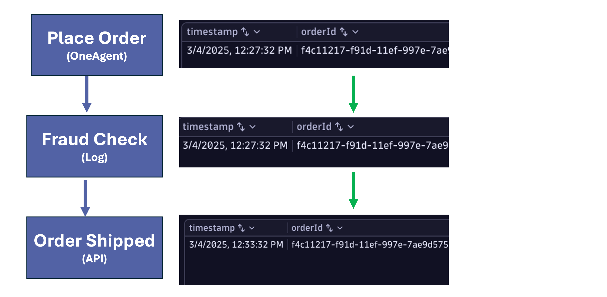
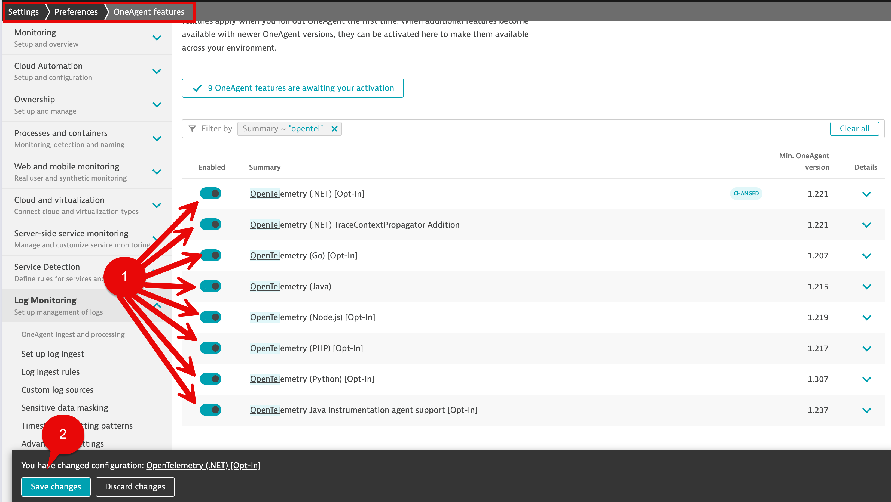
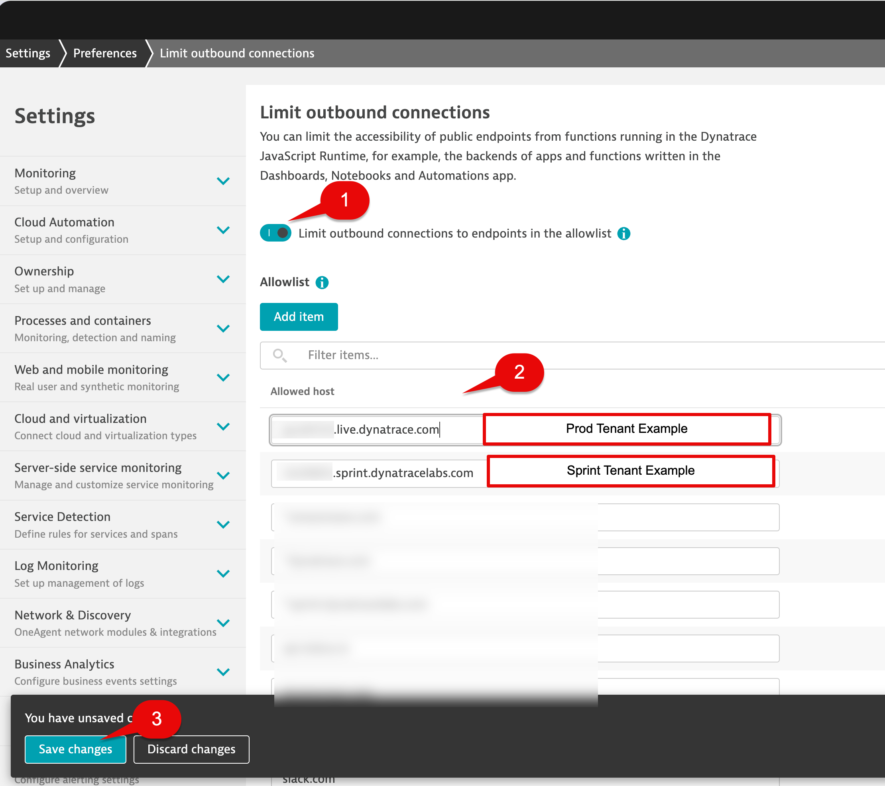
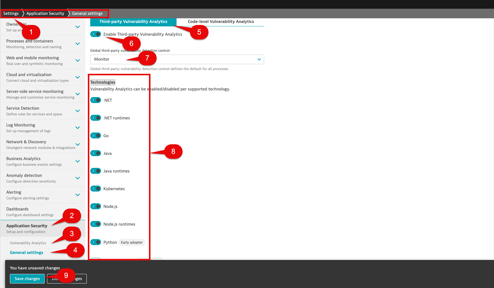
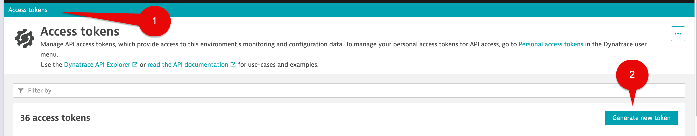
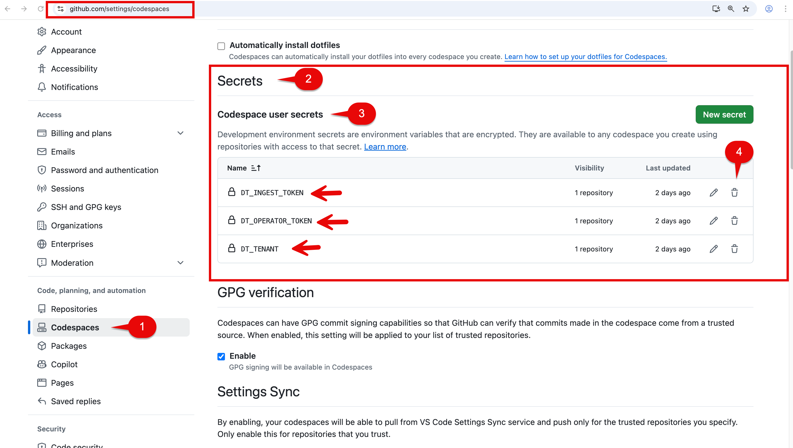
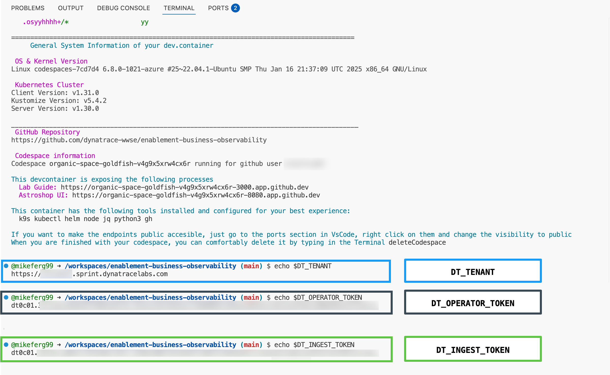
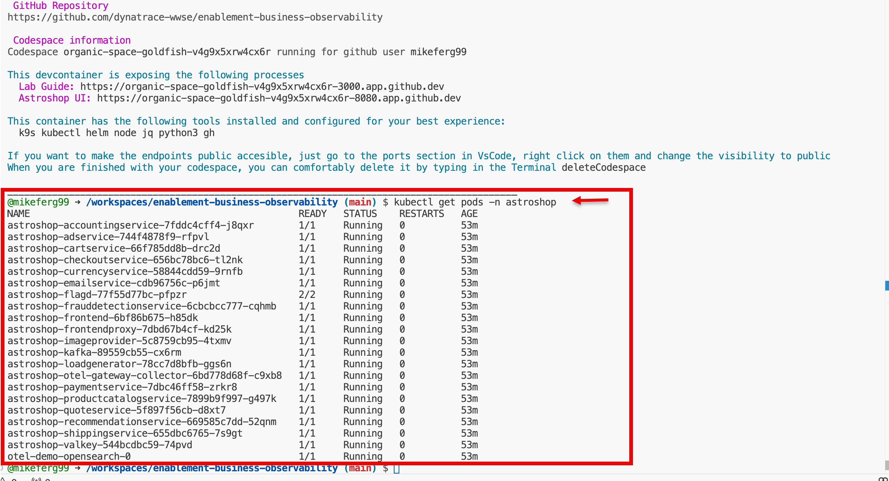
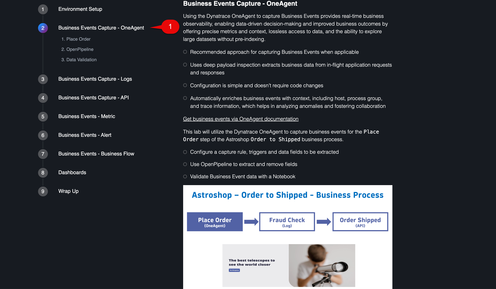

<!-- markdownlint-disable-next-line -->
#  Enablement Business Observability

[](https://dynatrace-wwse.github.io/codespaces-framework/)
[](https://hub.docker.com/r/shinojosa/dt-enablement)

[](https://github.com/dynatrace-wwse/enablement-business-observability/releases)
[](https://github.com/dynatrace-wwse/enablement-business-observability/graphs/commit-activity)
[](https://github.com/dynatrace-wwse/enablement-business-observability/blob/main/LICENSE)
[](https://dynatrace-wwse.github.io/enablement-business-observability/)

___

id: enablement-business-observability

summary: dynatrace business observability

author: Michael Ferguson
___

## Lab Overview

During this hands-on training, we'll explore Business Observability powered by BizEvents. During this session we configure business events using OneAgent, Logs and API data sources in context of a single process flow. Additionally, we will use OpenPipeline to generate and enrich telemetry signals. Using the data generated, we'll run powerful analytics with Business Flows, Notebooks, and Dashboards.

The Astroshop `Order to Shipped` Business Process will be the target use case:

```txt
Steps:

Step 1: Place Order
Step 2: Fraud Check
Step 3: Order Shipped

Correlation Id:

orderId
```


The training will start with:

1. Dynatrace Tenant Setup
1. Environment Setup using Github Codespaces

Then we will move to the hands on lab tasks:

1. Business Event Capture via the Dynatrace OneAgent - Place Order
1. Business Event Capture via Dynatrace ingested logs - Fraud Check
1. Business Event Capture via the events sent to the Dynatrace Business Events API - Order Shipped
1. Create a Metric from Business Events - Place Order
1. Create an Alert from Business Events - Place Order
1. Create a Business Flow and an Alert - Order to Shipped business process
1. Import and review sample Dashboards

Ready to learn the fundamentals of Business Observability with Dynatrace?

## [View the Lab Guide](https://dynatrace-wwse.github.io/enablement-business-observability)

---

# Legacy Lab Guide Instructions (deprecated)

## Dynatrace Tenant Setup

You will need a Dynatrace SaaS tenant.

### Identify Dynatrace SaaS Tenant

Make a note of the Dynatrace environment name. This is the first part of the URL. `abc123` would be the environment ID for `https://abc123.apps.dynatrace.com`. 

When you copy the url for the tenant, please enter it without the 'apps' part, see examples below: 

```txt
Production -> https://abc123.live.dynatrace.com

Sprint -> https://abc123.sprint.dynatracelabs.com
```

For example, if you are using a Dynatrace production tenant it will look like this below,  where abc123 would be your your-environment-id.

```txt
https://abc123.live.dynatrace.com
```

⚠️ Again, no apps in the URL! ⚠️

⚠️ Make sure there is no trailing / at the end ⚠️

### Enable Node.js Business Event OneAgent Feature

Open the `Settings Classic` App.

In the tree select `Preferences`, then `OneAgent features`.


Filter by:

```txt
Node.js Business Events
```

Select the sliders to enabled:

```txt
Node.js Business Events [Opt-In]
```

```txt
Instrumentation enabled (change needs a process restart)
```

Select the `Save changes` button at the bottom left of the screen.


### Enable OpenTelemetry OneAgent Features

Open the `Settings Classic` App.

In the tree select `Preferences`, then `OneAgent features`.


In the Filter by section, use below and hit return.

```txt
opentel
```

Enable all,  then expand the Details for each and make sure that second Enabled button is also selected where applicable.

When done, select the `Save changes` button.



### Enable Log Ingestion

Open the `Settings Classic` App.

In the tree select `Log Monitoring`, then `Log ingest rules`.

Make sure the `[Built-in] Ingest all logs` rule is enabled.


### Enable Limit Outbound Connections

During the hands on exercise we will use a Dynatrace Workflow to post data back to your tenanat via the Business Event API.  To do this we need to enable outbound connections for your tenant.

Open the `Settings Classic` App.

In the tree select `Preferences`, then `Limit outbound connections`.

Make sure the `Limit outbound connections to endpoints in the allow list` is enabled.

In the allow list section your tenant info as shown in below examples:

Examples

```txt
Production -> abc123.live.dynatrace.com 

Sprint -> abc123.sprint.dynatracelabs.com 
```

For example, if you are using a Dynatrace production tenant it will look like this below,  where abc123 would be your your-environment-id.

```txt
abc123.live.dynatrace.com
```

Select the Save changes button at the bottom left of the screen.



### Enable Third-party Vulnerability Analytics

Open the `Settings Classic` App.

In the tree select `Preferences`, then `Application Security`.  then `Vulnerability Analytics`, then `General` settings.

In `Third-party Vulnerability Analytics` tab, select `Enable Third-party Vulnerability Analytics` slider.

In the `Global third-party vulnerability detection control` section make sure `Monitor` is selected in the drop-down list.

In the `Technologies` section,  enable all technologies.

Select the Save changes button at the bottom left of the screen.



### Get the Operator Token and the Ingest Token from the Kubernetes App

Open the `Kubernetes` App.

Select the + Add cluster button.


Scroll down to the section `Install Dynatrace Operator`. 

Select the `Generate token` button for the `Dynatrace Operator`. Copy and save it to your Notepad.

Select the `Generate token` button for the `Data Ingest Token`.  Copy and save it to your Notepad.


You can close the Kubernetes App, we don't need it, we just needed the tokens.

### Create DT Business Event Token

Open the `Access tokens` classic app.

Select the `Generate new token` button.



In the `Token name` section provide a name.

In the `Select scopes from the table below` section find and select the checkbox for:

```txt
Ingest bizevents
```
Select the `Generate token` button at the bottom left of the page.


In the next screen, select the `Copy` button and save the token to your notepad as we will use this later.

Select the `Done` button.


### Conclusion

We have enabled Dynatrace tenant configurations for the following:

```txt
1. OneAgent Feature for Node.js Business Events
2. OneAgent Features for OpenTelemetry
3. Logs ingestion rule [Built-in] Ingest all logs
4. Limit outbound connections to endpoints
5. Third-party Vulnerability Analytics
```
You should now have 4 pieces of information:

```txt
1. A DT environment URL (DT_TENANT)
2. A Dynatrace Operator Token (DT_OPERATOR_TOKEN)
3. A Data Ingest Token (DT_INGEST_TOKEN)
4. An API token with permission for Business Events
```
We are now ready to move to the GitHub Repository and Code Spaces setup for this lab.

## GitHub Repository Setup

You will need a GitHub account.  Make sure you are logged in.

The source repository for this lab is: 

[enablement-business-observability](https://github.com/dynatrace-wwse/enablement-business-observability)

Open the link above in a new tab in your browser.

### Configure Codespaces Settings - Secrets

If you previously participated in a Dynatrace training using Codespaces, you may have existing secrets that will conflict with our training today.

Open the `GitHub Codespaces settings` link: [https://github.com/settings/codespaces](https://github.com/settings/codespaces) in a new tab in your browser.

Under the Secrets section,  Codespace user secrets,  check if these secrets exist.

```txt
DT_INGEST_TOKEN

DT_OPERATOR_TOKEN

DT_TENANT
```

If found, select the delete icon for each secret that exists.



You will get a `Delete secret` prompt, select the `Yes, delete this secret` button.


You may get a `Confirm access` prompt, enter your Github password and then select the `Confirm` button.


Leave the `GitHub Codespaces settings` browser tab open. 

In next section of this lab we will be changing another setting.

### Configure Codespaces Settings - Default idle timeout

By default, codespaces instances will suspend after 30 minutes of inactivity.  This may cause problems with your lab.  

Scroll down GitHub Codespaces settings section and find the section called `Default idle timeout`.

Increase the `Default idle timeout` setting in the minutes section to use the following:

```txt
240
```
Select the `Save` button.


When complete you can close the `GitHub Codespaces settings` browser tab.

### Codespaces Cluster Set Up

Click on `Code`.  Click on `Codespaces`.  Click on `New with options`.


Choose the Branch `main`.  

Choose the Dev Container Configuration `Enablement Business Observability`.

Choose a region close to your Dynatrace tenant. If you run into issues with spinning up your codespaces instance, try selecting a different region.

Choose Machine Type `4-core`.


Fill in recommend secrets sections for the following that you have in your saved notepad:

```txt
DT_TENANT

DT_OPERATOR_TOKEN

DT_INGEST_TOKEN
```
When done select the Create codespace button.


⚠️ If any of the secrets sections have a checkbox Associated with repository?, leave this browser tab open. 
Go back to Configure Codespaces Settings - Secrets section above in this lab and complete that section.
Refresh this browser tab and you should now be able to fill in the secrets. ⚠️

### Codespaces Codespace Instance

Your browser tab will change to the Codespace initialize screen.

Allow the Codespace instance to fully initialize.  It is not ready yet.

It will take about 10 minutes to fully finish.

During the initialize phase you will see:


The Codespace instance will run the post initialization scripts.


Again, it will take about 10 minutes to fully finish...give it time!

When fully finished you see below.


### Astroshop Validation

In the Codespace window,  you will see a section called: 

```txt
This devcontainer is exposing the following processes
```
In the  `Astroshop UI` section,  cmd + click the url or copy and paste the url in a new browser tab.  This will launch `Astroshop UI`.


If you caught in time you could also select the Open in Browser pop up at the very bottom right of the screen to Launch Astroshop.   Either approach works!


If for some reason Astroshop is not connecting when opening in new tab run the below command in the terminal.

```txt
exposeAstroshop
```

Then in the  `Astroshop UI` section,  cmd + click the url or copy and paste the url in a new browser tab.  This will launch `Astroshop UI`.

Take a minute to navigate around.


### Dynatrace Data Validation - Distributed Traces

Open the `Distributed Tracing` app.

In the filter section copy and paste this below:

```txt
Service = frontend AND Endpoint = "/api/checkout"
```

Select the `Update` button.


Validate you see traces for "/api/checkout".


Select a single trace to see the single trace details.


### Dynatrace Data Validation - Logs

Open the `Logs` app.

In the filter section copy and paste this below:

```txt
content = "*frauddetectionservice - Consumed record with orderId*"
```

Select the `Run query` button.


Validate you see log lines for "frauddetectionservice - Consumed record with orderId:".


### Troubleshooting

If you don't see data for Distributed Traces and Logs data validation steps above do the following.

Environment Variables Validation:

In the Codespaces terminal run the following commands:

```txt

echo $DT_TENANT

echo $DT_OPERATOR_TOKEN

echo $DT_INGEST_TOKEN
```

Validate the variables output to what you configured in the `Configure Codespaces Settings - Secrets` section above in this training.   

Make sure to check for:

```txt
⚠️ No apps in the URL! ⚠️

⚠️ Make sure there is no trailing / at the end of the DT_TENANT ⚠️

⚠️ Make sure the $DT_OPERATOR_TOKEN & $DT_INGEST_TOKEN are not the same ⚠️
```



If there are mistakes,  navigate to the GitHub Codespaces page at [https://github.com/codespaces/](https://github.com/codespaces/)

Locate your instance, click the `...` button, and click `Delete`.


Then go back and collect the correct information needed for:

```txt
DT_INGEST_TOKEN

DT_OPERATOR_TOKEN

DT_TENANT
```

Then resume the lab starting at the `Codespaces Cluster Set Up` section above in this training. 

If the variables are correct, we need to confirm Astroshop and Dynatrace are running correctly.

Astroshop Validation:

In the Codespaces terminal run the following commands:

```txt
kubectl get pods -n astroshop
```



Dynatrace Validation:

In the Codespaces terminal run the following commands:

```txt
kubectl get pods -n dynatrace
```


If any of the Astroshop or Dynatrace Pods are not in a STATUS of running it would be best to Delete this Codespace instance.

Navigate to the GitHub Codespaces page at [https://github.com/codespaces/](https://github.com/codespaces/)

Locate your instance, click the `...` button, and click `Delete`.


Then resume the lab starting at the `Codespaces Cluster Set Up` section above in this training.

### Codespace Disconnected

When your Codespace for this training is up and running and you accidently close the Codespace browser tab, or network reconnection errors occur, don't worry, we can relaunch it.    

Navigate to the GitHub Codespaces page at [https://github.com/codespaces/](https://github.com/codespaces/)

At the bottom of the page under the `Owned by` section, you should see your Codespace instance in an `Active` state.

Select the `...` to the right of Active.

This will open a menu of items.  

Select `Open in Browser`.   


This will launch your running Codespace instance in a new browser tab.

### Hands On Lab Guide

In the Codespace window,  you will see a section called: 

```txt
This devcontainer is exposing the following processes
```
In the  `Lab Guide` section,  cmd + click the url or copy and paste the url in a new browser tab.  This will launch `Lab Guide`.


If for some reason the Lab Guide is not connecting when opening in new tab run the below command in the terminal.

```txt
exposeLabguide
```

Then in the  `Lab Guide` section,  cmd + click the url or copy and paste the url in a new browser tab.  This will launch `Lab Guide`.

Use the `Lab Guide` for the rest of the training. 

Start on exercise section 2 - Business Event Capture - OneAgent.


