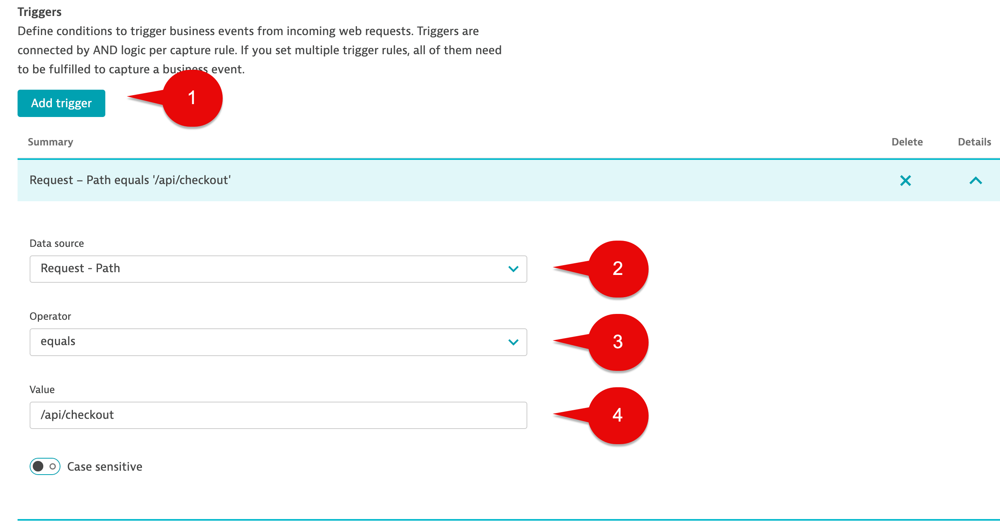
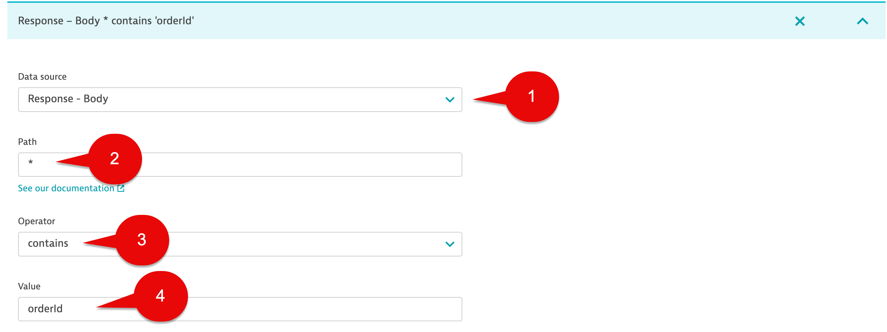
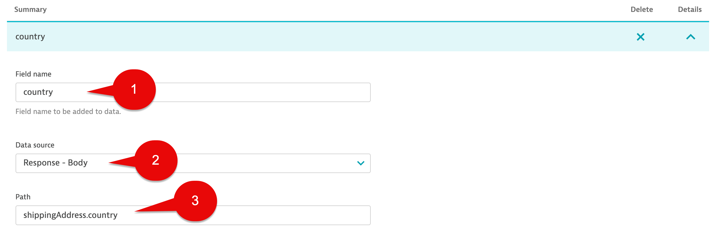
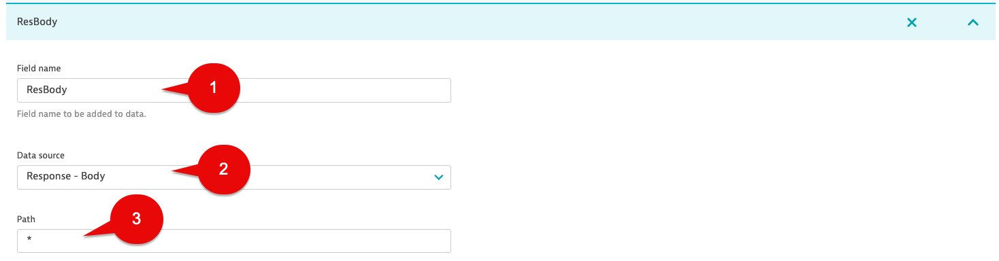
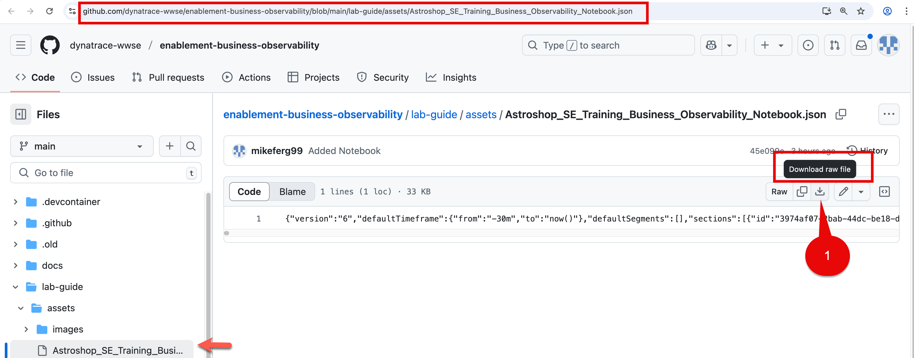
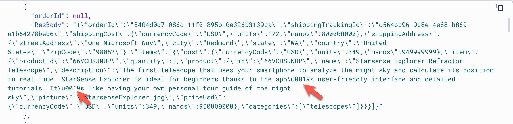
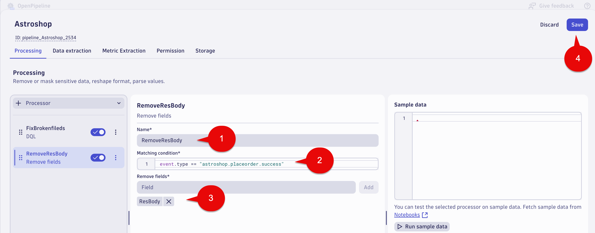
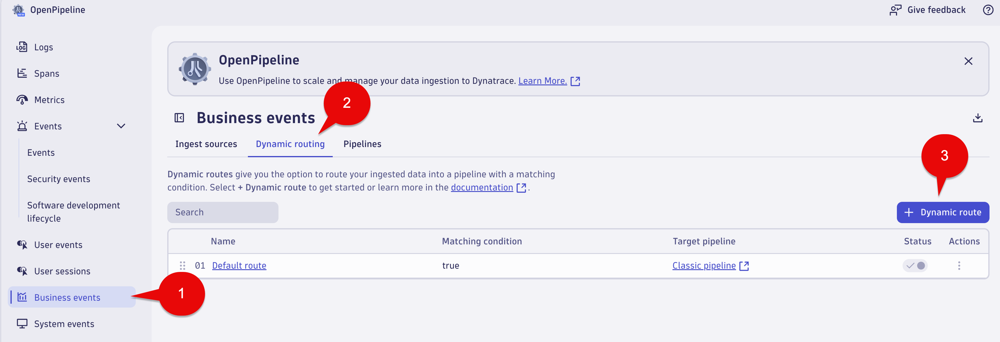

--8<-- "snippets/send-bizevent/bizevent-04-bizevents-oneagent.js"

# Business Events Capture - OneAgent

Using the Dynatrace OneAgent to capture Business Events provides real-time business observability, enabling data-driven decision-making and improved business outcomes by offering precise metrics and context, lossless access to data, and the ability to explore large datasets without pre-indexing.

* Recommended approach for capturing Business Events when applicable

* Uses deep payload inspection extracts business data from in-flight application requests and responses

* Configuration is simple and doesn’t require code changes

* Automatically enriches business events with context, including host, process group, and trace information, which helps in analyzing anomalies and fostering collaboration

[Get business events via OneAgent documentation](https://docs.dynatrace.com/docs/shortlink/ba-business-events-capturing#report-business-event-oneagent)

This lab will utilize the Dynatrace OneAgent to capture business events for the `Place Order` step of the Astroshop `Order to Shipped` business process.

* Configure a capture rule, triggers and data fields to be extracted
* Use OpenPipeline to extract and remove fields
* Validate Business Event data with a Notebook


## Place Order

In this section of the lab we will configure a Business Event capture rule for `Place Order` step of the `Order to Shipped` business process.

### Business Event - Source Settings

Go to Settings Classic > Business Analytics > OneAgent Business Event Sources.

Select the Incoming tab.


### Business Event - Capture Rule

Select the Add new capture rule button and name your rule using the following name: 

```text
astroshop_placeorder_success
```


### Business Event - Triggers

To capture Business Events from incoming web requests, we need to define conditions which are called Triggers.  Triggers are connected by AND logic per capture rule. If you set multiple trigger rules, all of them need to be fulfilled to capture a business event.

We will use 3 triggers:

**Trigger 1**

Select the Add trigger button.

In the `Data source` drop down list select:  

```text
Request - Path
```

In the `Operator` drop down list select: 

```text
equals
```

In the `Value` field use: 

```text
/api/checkout
```



**Trigger 2**

Select the Add trigger button.

In the `Data source` drop down list select:  

```text
Response - Body
```

In the `Path` field use: 

```text
*
```

In the `Operator` drop down list select: 

```text
contains
```

In the `value` field use:  

```text
orderId
```



**Trigger 3**

Select the Add trigger button.

In the `Data source` drop down list select:  

```text
Response - HTTP Status Code
```

In the `Operator` drop down list select: 

```text
equals
```

In the `Value` field use: 

```text
200
```


### Business Event - Event Provider

The `Event Provider` is the source of the event, for example, the name of the component or system that generated the event.

Under Event meta data, for the Event provider section use the following:

In the `Data source` drop down list select:

```text
Fixed value
```

In the `Fixed value` section use:

```text
astroshop
```


### Business Event - Event Type

The Event Type is the unique identifier of a given event.

Under Event meta data, for the Event type section use the following:

In the `Data source` drop down list select:

```text
Fixed value
```

In the `Fixed value` section use:

```text
astroshop.placeorder.success
```


## Business Event - Event Category

The `Event Category` is optional.  

For this lab we will leave the default value which should be empty.

### Business Event - Event Meta Data

The steps so far conclude the configuration of a business event that will be generated each time the trigger criteria is matched. This might be sufficient if all you need is to answer the question of how many `astroshop_placeorder_success` events were called. 

In most cases you will want to add event attributes to provide granular insight. `Attributes` are data fields extracted from the event `JSON` or `XML` payload.

Below is sample response payload for the `Place Order` transaction.  The following steps will cover how to extract the `orderId` and `units` (units will be used for the revenue number) and more from the response payload.  

Capturing the `orderId` is critical for this business process as it will be unique identifier (correlation ID) that is common to all of the process steps.

**Note:** Use must use exact letter casing for fields that you define for data extraction. 

```json
{
    "orderId": "09766d7d-0530-11f0-895b-0e326b3139ca",
    "shippingTrackingId": "c51af8bd-3fe1-4a46-9d9b-45a16cd7cd66",
    "shippingCost": {
        "currencyCode": "USD",
        "units": 47,
        "nanos": 700000000
    },
    "shippingAddress": {
        "streetAddress": "1600 Amphitheatre Parkway",
        "city": "Mountain View",
        "state": "CA",
        "country": "United States",
        "zipCode": "94043"
    },
    "items": [
        {
            "cost": {
                "currencyCode": "USD",
                "units": 349,
                "nanos": 949999999
            },
            "item": {
                "productId": "66VCHSJNUP",
                "quantity": 1,
                "product": {
                    "id": "66VCHSJNUP",
                    "name": "Starsense Explorer Refractor Telescope",
                    "description": "The first telescope that uses your smartphone to analyze the night sky and calculate its position in real time. StarSense Explorer is ideal for beginners thanks to the app’s user-friendly interface and detailed tutorials. It’s like having your own personal tour guide of the night sky",
                    "picture": "StarsenseExplorer.jpg",
                    "priceUsd": {
                        "currencyCode": "USD",
                        "units": 349,
                        "nanos": 950000000
                    },
                    "categories": [
                        "telescopes"
                    ]
                }
            }
        }
    ]
}
```

Below is sample request payload for the `Place Order` transaction.  The following steps will cover how to extract the `userId` from the response payload. 

**Note:** Use must use exact letter casing for fields that you define for data extraction.

```json
{
        "userId": "2e31768f-dc87-4a74-b70f-5972ecca30b1",
        "email": "mark@example.com",
        "address": {
          "streetAddress": "1 Hacker Way",
          "state": "CA",
          "country": "United States",
          "city": "Menlo Park",
          "zipCode": "94025"
        },
        "userCurrency": "USD",
        "creditCard": {
          "creditCardCvv": "***",
          "creditCardExpirationMonth": "*",
          "creditCardExpirationYear": "****",
          "creditCardNumber": "****-****-****-****"
        }
}
```
 
The following table shows additional examples of how to extract data from JSON payloads.


[Dynatrace Documentation Link](https://docs.dynatrace.com/docs/shortlink/ba-business-events-capturing#json)

### Business Event - orderId Capture

Under the Event data section, select the Add data field button.

In the `Field name` section use: 

```text
orderId
```

In the `Data Source` drop down list select:

```text
Response - Body
```

In the `Path` section use:

```text
orderId
```


### Business Event - country Capture

Under the Event data section, select the Add data field button.

In the `Field name` section use: 

```text
country
```

In the `Data Source` drop down list select:

```text
Response - Body
```

In the `Path` section use:

```text
shippingAddress.country
```



### Business Event - userId Capture

Under the Event data section, select the Add data field button.

In the `Field name` section use: 

```text
userId
```

In the `Data Source` drop down list select:

```text
Request - Body
```

In the `Path` section use:

```text
userId
```


### Business Event - revenue Capture

Under the Event data section, select the Add data field button.

In the `Field name` section use: 

```text
revenue
```

In the `Data Source` drop down list select:

```text
Response - Body
```

In the `Path` section use:

```text
items.0.cost.units
```


### Business Event - shippingTrackingId Capture

Under the Event data section, select the Add data field button.

In the `Field name` section use: 

```text
shippingTrackingId
```

In the `Data Source` drop down list select:

```text
Response - Body
```

In the `Path` section use:

```text
shippingTrackingId
```


### Business Event - Full Response Body Capture

Under the Event data section, select the Add data field button.

In the `Field name` section use: 

```text
ResBody
```

In the `Data Source` drop down list select:

```text
Response - Body
```

In the `Path` section use:

```text
*
```



`Note:` Some use cases might require capturing and store the full response body.  OpenPipeline can be used for Business Events to extract needed fields, masking.   You can also drop the full response body field keeping only what extract.  

This approach is also helpful for data validation/debugging during initial setup but not using when you fully deploy.  Lastly, using * for the path field value will capture everything. For this lab will use the full response body.

### Business Event - Save Rule

Click the Save changes button.


### Query Business Events in Dynatrace

Provided Notebook

`Astroshop_SE_Training_Business_Observability_Notebook`

Import the Notebook using the source file [Astroshop_SE_Training_Business_Observability_Notebook](https://github.com/dynatrace-wwse/enablement-business-observability/blob/main/assets/dynatrace/notebooks/Astroshop_SE_Training_Business_Observability_Notebook.json) by downloading to your local system and upload to the Notebooks app. This can be during the labs exercises.



Or, using your own Notebook execute the below DQL query which retrieves the business events for `astroshop.placeorder.success` step.

DQL:
```sql
fetch bizevents
| filter event.provider == "astroshop" and event.type == "astroshop.placeorder.success"
| fields timestamp, event.provider, event.type, userId, orderId, revenue, country,trace_id,ResBody
| sort timestamp desc
```

Result:


Notice we have null values for `orderId`, `revenue`, `country` fields.   

When reviewing the Response Payload, there are multiple references for the string '\u0019'. This is a unicode string that denotes End Of Medium.  JSON parsing from the OneAgent capture won't work for this use case.   



This would be probably rare in your most environments.  Don't worry, for this lab we can fix capturing  `orderId`, `revenue`, `country` fields using a OpenPipeline rule.

### Conclusion

We have completed the Business Event capture using the OneAgent for `Place Order Success` step of the `Order to Shipped` business process.  The next section will cover using OpenPipeline to replace the null fields with correct data.

## OpenPipeline

In this section of the lab we will use OpenPipeline to replace the  `orderId`, `revenue`, `country` fields values when they are null. Using OpenPipeline, the `ResBdy` field will be used to extract the correct values needed for the `Place Order` Business Event.

## Business Events - OpenPipeline - Place Order

Launch the OpenPipeline app.

Select `Business events` in the OpenPipeline tree.

Select `Pipelines` tab.

Select the `+ Pipeline` button.


## Business Events - OpenPipeline - Processing - Place Order

Name your OpenPipeline rule using the following name: 

```text
Astroshop
```

Select the `Processing` tab.

Select the `+ Processor` button (left side of the screen), then select `DQL`.


Fill out the fields with the following data:

Name: 

```text
FixFieldsWithNullValues
```

Matching condition: 

```text
event.type == "astroshop.placeorder.success" and isNull(orderId)
```

DQL processor definition: 

```txt
parse ResBody, """DATA 'orderId":' DQS:orderId LD 'shippingTrackingId":' DQS:shippingTrackingId LD 'units":' DOUBLE:revenue LD  LD 'country":' DQS:country"""
```

Sample data:

```json

     {
           "timestamp": "2025-03-26T23:39:04.840000000-04:00",
           "event.provider": "astroshop",
           "event.type": "astroshop.placeorder.success",
           "userId": "ae844c70-5b7e-471f-9cfb-07715a46bc8d",
           "orderId": null,
           "revenue": null,
           "country": null,
           "trace_id": "104a1ee54db91be0ff9acbcb65cdfee4",
           "ResBody": "{\"orderId\":\"07fa8ff2-0abd-11f0-92d2-0e1e3ab12988\",\"shippingTrackingId\":\"6fd4c157-ca6b-465e-bc39-a5096d6ee08c\",\"shippingCost\":{\"currencyCode\":\"USD\",\"units\":84,\"nanos\":400000000},\"shippingAddress\":{\"streetAddress\":\"1 Hacker Way\",\"city\":\"Menlo Park\",\"state\":\"CA\",\"country\":\"United States\",\"zipCode\":\"94025\"},\"items\":[{\"cost\":{\"currencyCode\":\"USD\",\"units\":209,\"nanos\":949999999},\"item\":{\"productId\":\"2ZYFJ3GM2N\",\"quantity\":2,\"product\":{\"id\":\"2ZYFJ3GM2N\",\"name\":\"Roof Binoculars\",\"description\":\"This versatile, all-around binocular is a great choice for the trail, the stadium, the arena, or just about anywhere you want a close-up view of the action without sacrificing brightness or detail. It\u0019s an especially great companion for nature observation and bird watching, with ED glass that helps you spot the subtlest field markings and a close focus of just 6.5 feet.\",\"picture\":\"RoofBinoculars.jpg\",\"priceUsd\":{\"currencyCode\":\"USD\",\"units\":209,\"nanos\":950000000},\"categories\":[\"binoculars\"]}}}]}"
         }
     
```

Select the `Run sample data` button.

Under the `Preview result` section validate `orderId`, `country` and `revenue` fields have values.


## Business Events - OpenPipeline - Processing - Remove ResBody Field

Select the `+ Processor` button (left side of the screen), then select `Remove fields`


Fill out the fields with the following data:

Name: 

```text
RemoveResBody
```

Matching condition: 

```text
event.type == "astroshop.placeorder.success"
```

Remove fields:

After adding the below field to remove, select the Add button.

```text
ResBody
```

Select the Save Button at the top right of the screen.



## Business Events - OpenPipeline Dynamic Route - Place Order

Now we need to create a Dynamic route for the Astroshop Business Events pipeline. Dynamic routes give you the option to route your ingested data into a pipeline with a matching condition.

Select `Business events` in the OpenPipeline tree. 

Select `Dynamic routing` tab.

Select `+ Dynamic route` button.



Configure the Dynamic route with the following:

Name:

```text
Astroshop_BusinessEvents
```

Matching condition:

```text
event.provider == "astroshop"
```

Pipeline:

In the dropdown list select the following:

```text
Astroshop
```

Select the `Add` button.


Select the `Save` button.

```text
A warning icon with this message will appear "Do you want to save your changes to this table?" 
```
Select the `Save` button.


### Conclusion

We have completed the Business Event OpenPipeline section for `Place Order` step of the `Order to Shipped` business process.  This section covered how to use OpenPipeline to replace the null values  for `orderId`, `revenue`, `country` with the correct values.  The next section will validate the data.

## Data Validation

In this section of the lab we will validate the data for the `Place Order` step of the `Order to Shipped` business process.

### Query Business Events in Dynatrace

Using a Notebook execute the below DQL query which retrieves the buisness events for `astroshop.placeorder.success` step.  

DQL:
```sql
fetch bizevents
| filter event.provider == "astroshop" and event.type == "astroshop.placeorder.success"
| fields timestamp, event.provider, event.type, userId, orderId, revenue, country, shippingTrackingId, trace_id
| sort timestamp desc
```

Result:


### Conclusion

We have completed data validation for the `Place Order` step of the `Order to Shipped` business process.

## Data Validation

In this section of the lab we will validate the data for the `Place Order` step of the `Order to Shipped` business process.

### Query Business Events in Dynatrace

Using a Notebook execute the below DQL query which retrieves the buisness events for `astroshop.placeorder.success` step.  

DQL:
```sql
fetch bizevents
| filter event.provider == "astroshop" and event.type == "astroshop.placeorder.success"
| fields timestamp, event.provider, event.type, userId, orderId, revenue, country, shippingTrackingId, trace_id
| sort timestamp desc
```

Result:


### Conclusion

We have completed data validation for the `Place Order` step of the `Order to Shipped` business process.

## Continue

In the next section, we'll capture Business Events from Logs using OpenPipeline.

<div class="grid cards" markdown>
- [Continue to Business Event Capture with Logs:octicons-arrow-right-24:](05_bizevents_logs.md)
</div>