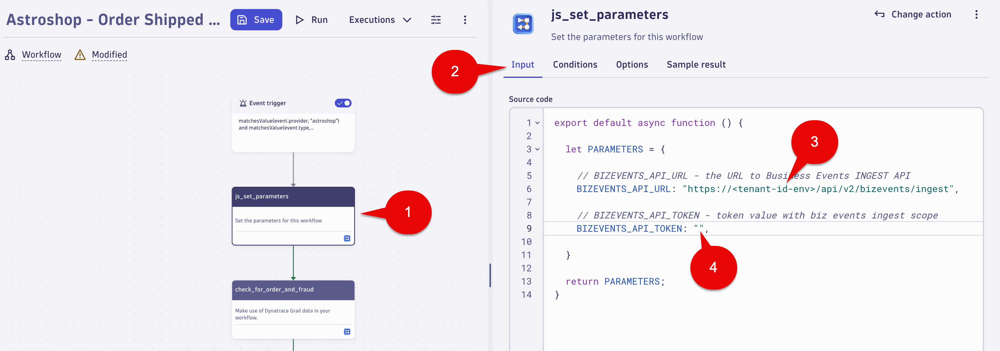
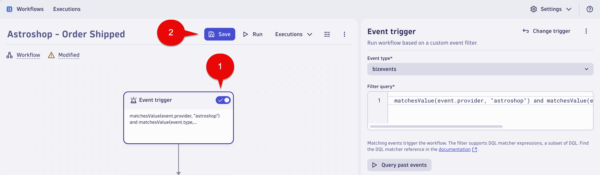
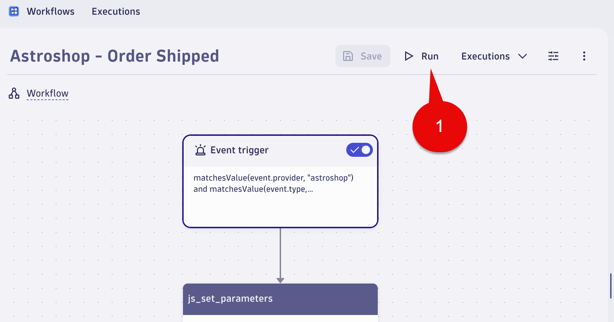
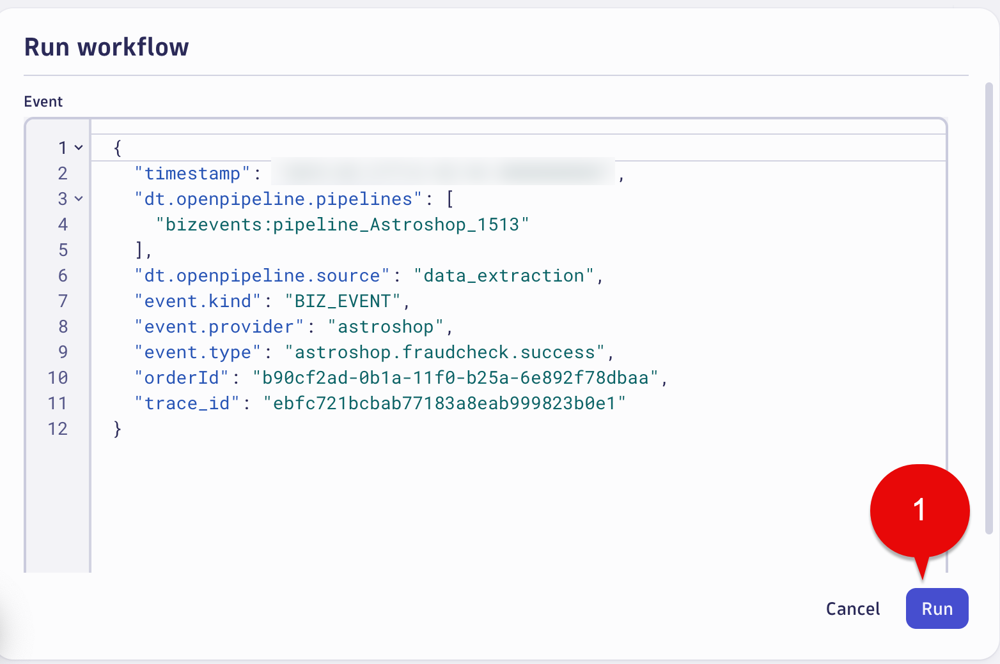
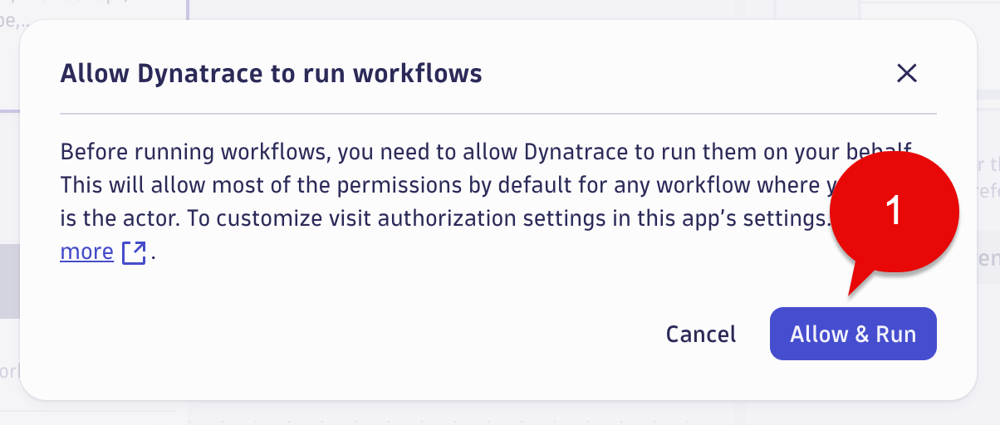
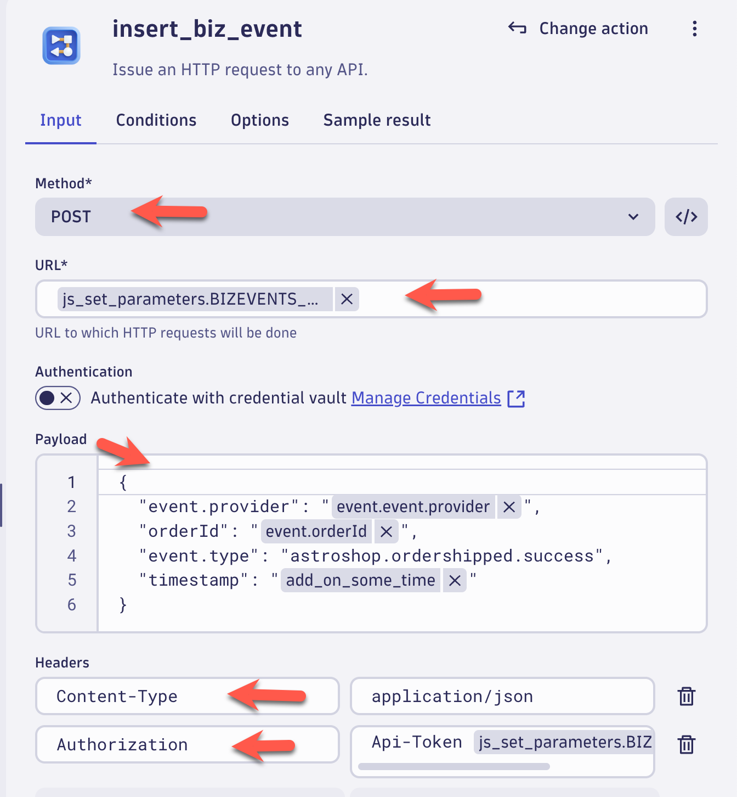
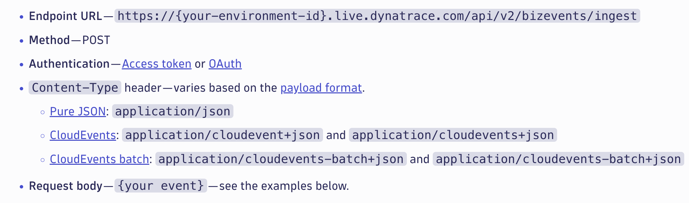
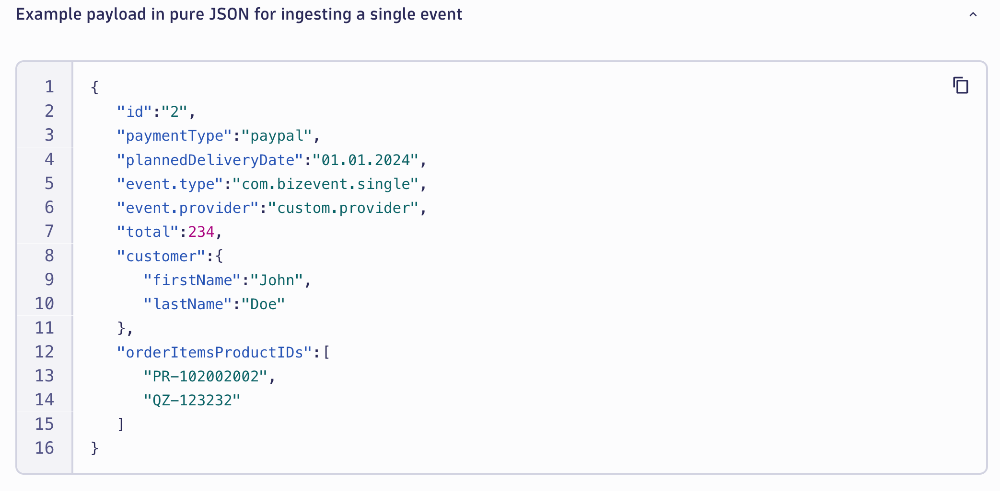
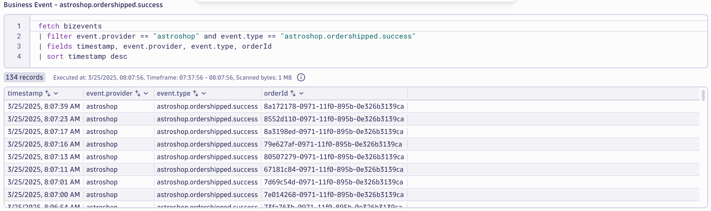

--8<-- "snippets/send-bizevent/bizevent-06-bizevents-api.js"

# Business Events Capture - API

Organizations in today’s data-driven world often struggle with fragmented data sources that hinder comprehensive business insights.  Using the Dynatrace Business Event API, external business or IT systems can be used as another data source to send for business event data Dynatrace.

This approach is useful when business-relevant information needs to be used and no other ingest path for business events is available.

The Dynatrace Business Event API supports JSON, CloudEvents and CloudEvents batch payload formats.  

Supported Authentication Types: 

* Access token
* OAuth 

[Ingest business events via API documentation](https://docs.dynatrace.com/docs/shortlink/ba-api-ingest)

This lab will utilize sending event data to the Business Events API for the `Order Shipped` step of the Astroshop `Order to Shipped` business process.

* Use a workflow to send `Order Shipped` business events to the Business Events API 
* Validate the data using a Notebook


## Order Shipped

In this section of the lab we will use a Dynatrace Workflow to send simulated events that represent the `Astroshop Shipping` system when an Order is Shipped.  These events will leverage the Business Events API for the `Order Shipped` step of the Astroshop `Order to Shipped` business process.  

### Workflow - Order Shipped - Download


Download the workflow `Astroshop - Order Shipped` using the source file [Astroshop - Order Shipped](https://github.com/dynatrace-wwse/enablement-business-observability/blob/main/assets/dynatrace/workflows/dt_wftpl_astroshop_-_order_shipped.yaml) to your local system.


### Workflow - Order Shipped - Upload and Import

Open the Dynatrace Workflow app.

Workflows are imported using the Upload button. 


Pick the `dt_wftpl_astroshop_-_order_shipped.yaml` from your local system.

When loaded a screen will appear called `Import workflow "Astroshop - Order Shipped"`

Select `Import` button.


###  Workflow - Order Shipped - js_set_parameters

Select the `js_set_parameters`.

`Note:`  This will be the task/action that defines the parameters/variables that will be used by subsequent tasks and returns them in the result. By setting the parameters as nested attribute key:value pairs within a single variable, as additional parameters are needed they can easily be added without modifying any other code. Great best practice for any workflows you create.

In the `Input section` set the values of the missing variables with the following:

```txt
BIZEVENTS_API_URL:

Replace `<tenant-id-env>` with your Dynatrace environment ID and Env.
    
Prod Example:   `xxxxxx.live.dynatrace.com`  
Sprint Example: `xxxxxx.sprint.dynatracelabs.com`
```
```txt
BIZEVENTS_API_TOKEN:

Use the Business Event API Token we created in the Environment Setup.  

Paste your token in between the quotes.
```


Example should look like below:


###  Workflow - Order Shipped - Enable, Save and Run

Enable the `Event Trigger` flow.

Select Save button.



When you run a workflow in an environment for the first time, Dynatrace asks to allow the AutomationEngine to run workflows for you.

Click the Run button.



In the Run workflow window, click the Run button.



Click Allow and Run button.



###  Workflow - Order Shipped - Review

We will review the task(s)/action(s) of the `Astroshop - Order Shipped` Workflow.  As discussed above, the workflow is sending simulated events that represent the `Astroshop Shipping` system when an Order is shipped.

The most important task/action of this workflow is `insert_biz_event` task/action.  The included parameters match the required paramaters as if your customer was sending Business Events from their Environment/System to Dynatrace Business Events API.

Below are the settings used in the `insert_biz_event` task/action of the `Astroshop - Order Shipped` workflow.



[Business Events API Documenation](https://docs.dynatrace.com/docs/shortlink/ba-api-ingest#ingest-endpoint)





### Conclusion

We have completed the step of using a Dynatrace Workflow to send simulated events that represent the Astroshop Shipping system when an `Order Shipped` events occur. The next section will validate the data.

## Data Validation

In this section of the lab we will validate the data for the `Order Shipped` step of the `Order to Shipped` business process.

### Query Business Events in Dynatrace

Using a Notebook execute the below DQL query which retrieves the business events for `astroshop.ordershipped.success` step.  

DQL:
```sql
fetch bizevents
| filter event.provider == "astroshop" and event.type == "astroshop.ordershipped.success"
| fields timestamp, event.provider, event.type, orderId
| sort timestamp desc
```

Result:



### Conclusion

We have completed data validation for the `Order Shipped` step of the `Order to Shipped` business process.

## Continue

In the next section, we'll use the captured Business Events to build a Business Metric utilizing OpenPipeline. 

<div class="grid cards" markdown>
- [Continue to Business Event Capture with Metric:octicons-arrow-right-24:](07_bizevents_metric.md)
</div>