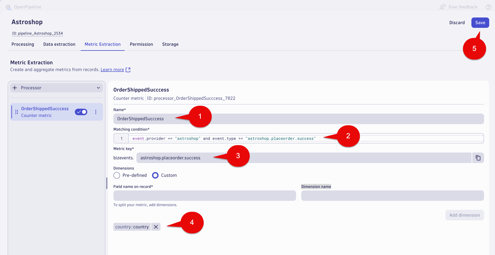

--8<-- "snippets/send-bizevent/file.js"

## Business Events - Metric

Business event metric extraction is a convenient way to create your own business metrics. 

It enables you to:

* To use with Dashboards and Notebooks for real-time monitoring and historical data analysis 
* Alerting, such as when a certain value surges or drops 

This lab will utilize OpenPipeline to make a business metric from business events for the `Place Order` step of the Astroshop `Order to Shipped` business process.


## Place Order Metric

In this section of the lab we will create a counter metric for `Place Order` step.  We also want to report by Country.

## Business Metric - OpenPipeline - Place Order

Launch the OpenPipeline app.

Select `Business events` in the OpenPipeline tree.

Select `Pipelines` tab.

Select the `Astroshop` Pipeline.


## Business Metric - OpenPipeline Processing - Place Order

Select the `Metric Extraction` tab.

Select the `+ Processor` button (left side of the screen), then select `Counter metric`


`Note`: 

* `Counter metric` 

```text
Where you want to count the number `Place Order` occurrences.
```

* `Value metric` 

```text
Where you want to report on `Revenue`. The revenue field captured in the `Place Order` 
Business Event data values would be extracted and used as the metric value. 
```

Fill out the fields with the following data:

Name: 

```text
OrderShippedSucccess
```

Matching condition: 

```text
event.provider == "astroshop" and event.type == "astroshop.placeorder.success"
```

Metric key: 

```text
astroshop.placeorder.success
```

Dimensions: 

Select the Custom radio button.

For the `Field name on record` and `Dimension name` sections use:

```text
country
```

Click the `Add dimension` button.  This will add both fields. 

Select the Save button at the top right of the screen.



### Conclusion

We have completed the Business Metric capture for `Placer Order` step  of the `Order to Shipped` business process. The next section will validate the data.

## Data Validation

In this section of the lab we will validate the data for the `Place Order` business metric.   We also want to see it broken out by country.

### Query Business Metric in Dynatrace

Using a Notebook execute the below DQL query which retrieves the business metric `bizevents.astroshop.placeorder.success` split by country.  Note, you shoud see data within 3-5 minutes.

DQL:
```sql
timeseries placeorder.success = sum(bizevents.astroshop.placeorder.success), by:{country}
```

Result:


### Conclusion

We have completed data validation for the `Place Order` business metric.

### Subtopic

The demo application in this lab, AstroShop, contains OpenTelemetry instrumentation that can be picked up by OneAgent.


## Continue

In the next section, we'll launch our Codespaces instance.

<div class="grid cards" markdown>
- [Continue to Codespaces:octicons-arrow-right-24:](3-codespaces.md)
</div>