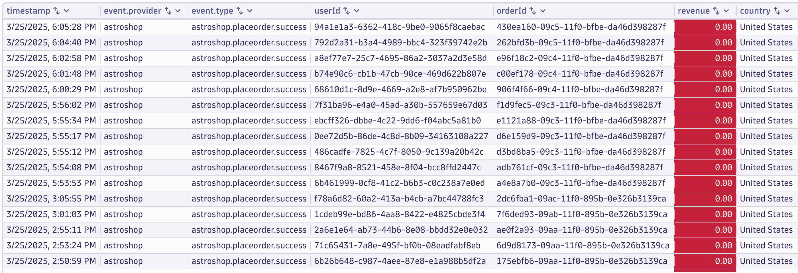
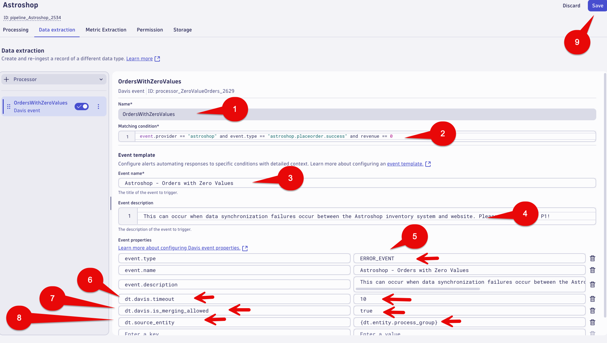

--8<-- "snippets/send-bizevent/bizevent-08-bizevents-alerts.js"

# Business Events - Alert

Real-time business metric alerting in Dynatrace is crucial for proactive issue identification, rapid response, and optimized business outcomes by enabling businesses to monitor and react to performance issues impacting key business processes and user experience before they escalate. 

By proactively addressing performance issues and optimizing business processes, Dynatrace helps organizations achieve better business outcomes, such as increased revenue, higher conversion rates, and improved customer satisfaction. 

This lab will we will use the `Place Order` business events `Revenue` data to create an alert when `Orders` have revenue = 0.   

This is an example scenario for this lab, but synchronization failures can happen and Dynatrace can provide immediate alerting notification when they occur.

Examples of where this could occur:

* Manual Data Entry
* Different Coding Systems
* Bidirectional Syncing



## Business Alert

In this section of the lab we will create an alert for `Place Order` Business Events that have revenue = 0.

## Business Alert - OpenPipeline - Place Order

Launch the OpenPipeline app.

Select `Business events` in the OpenPipeline tree.

Select `Pipelines` tab.

Select the `Astroshop` Pipeline.


## Business Alert - OpenPipeline - Data extraction - Place Order

Select `Data extraction` tab.

Select the `+ Processor` button (left side of the screen), then select `Davis event`.


Fill out the fields with the following data:

Name: 

```text
OrdersWithZeroValues
```

Matching condition: 

```text
event.provider == "astroshop" and event.type == "astroshop.placeorder.success" and revenue == 0
```

Event template: 

```text
Astroshop - Orders with Zero Values
```

Event description: 

```text
This can occur when data synchronization failures occur between the Astroshop inventory system and website. Please treat this a P1!
```

Event properties:

Davis events are enriched with additional fields, as detailed in the [Davis event model documentation](https://docs.dynatrace.com/docs/shortlink/semantic-dictionary-davis-ai#event).

```text
The event.type, event.name and event.description sections should be 
pre-filled from the previous entries you configured above.  

We will only change the event.type field.
```
Plese update the event.type field to use the following:

```text
Right side value:   ERROR_EVENT
```

Please add new entries for Event properties section using the following:

```text
Left side name:     dt.davis.timeout
Right side value:   10
```

```text
Left side:          dt.davis.is_merging_allowed 
Right side value:   true
```

```text

Left side name:     dt.source_entity 
Right side value:   {dt.entity.process_group}
```

Select the Save Button at the top right of the screen.



### Conclusion

We have completed the `Place Order` Business Alert.  The next section will validate the data.

## Data Validation

In this section of the lab we will validate the data for the `Place Order` Business Alert was fired.   

### Problems App

Open Problems App,  you should see `Astroshop - Orders with Zero Values` problem generated within 10-20 minutes.  We can come back to this data validation after the next section is complete.


### Conclusion

We have completed data validation for the `Place Order` Business Alert.

### Subtopic

The demo application in this lab, AstroShop, contains OpenTelemetry instrumentation that can be picked up by OneAgent.


## Continue

In the next section, we'll launch our Codespaces instance.

<div class="grid cards" markdown>
- [Continue to Codespaces:octicons-arrow-right-24:](3-codespaces.md)
</div>