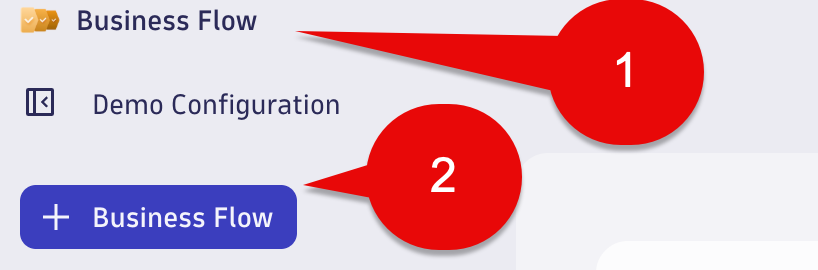
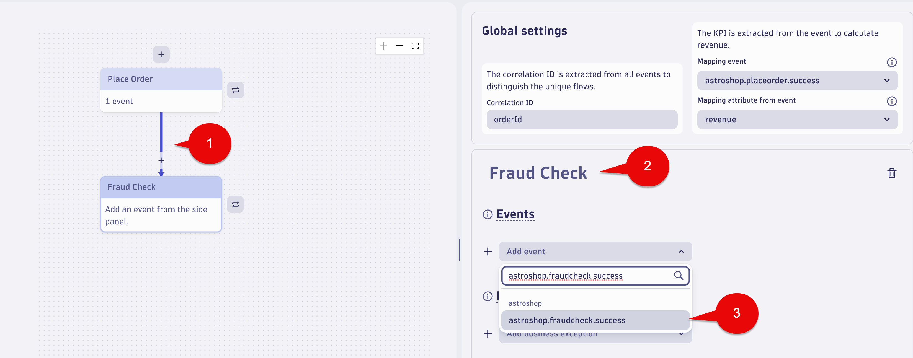
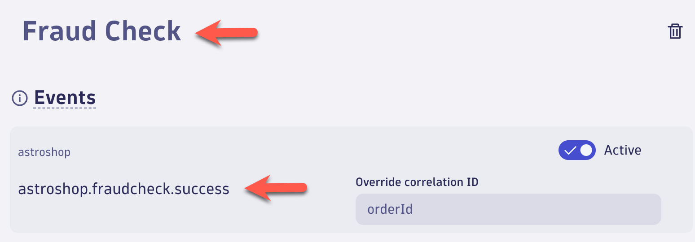
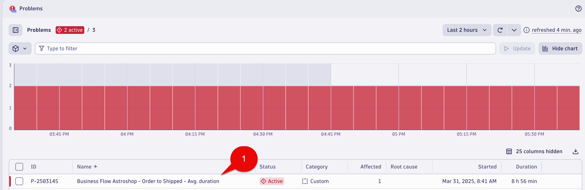

--8<-- "snippets/send-bizevent/bizevents-09-business-flow.js"

# Business Events - Business Flow
  
IT teams and business owners can use Business Flow Business Flow App to monitor and analyze critical business process flows. You can track end-to-end process delays, detect process anomalies, and report business key performance indicators (KPIs).

With Business Flow App, you can:

* Report business process KPIs, including flows completed (conversions), average flow completion time, business exceptions, and a business KPI of your choice
* Visualize and analyze individual process flows from start to finish
* Detect and explore uncompleted or dropped process flows to determine the cause, such as an IT error, a business exception, or  abnormal inter-step transit time
* Visualize process errors and business exceptions at each step

## Business Flow
  
In this section of the lab we will create a Business Flow using the Business Events we have defined for the Astroshop `Order to Shipped` business process.

## Business Flow - Order to Shipped - Configuration Name

Launch the Business Flow app.

Select `+ Business Flow ` to get to the configuration page.



Select the Pencil icon at the top left and rename the Configuration using the following:

Name:

```txt
Astroshop - Order to Shipped
```

Select the Save button.


## Business Flow - Place Order Step

For `Step 1` configuration use the following:

Name - (click the Step 1 box to edit):

```txt
Place Order
```

Drop-down event box:

```txt
astroshop.placeorder.success
```


After picking `astroshop.placeorder.success`, the `Place Order` step should look like this below:


## Business Flow - Fraud Check Step

Click the `Place Order` step.  

Select the + button on the bottom.  

This will add a new step under the `Place Order` called `Step 2`. 

For `Step 2` configuration use the following:

Name - (click the Step 2 box to edit):

```txt
Fraud Check
```

Drop-down event box:

```txt
astroshop.fraudcheck.success
```



After picking `astroshop.fraudcheck.success`, the `Fraud Check` step should look like this below:



## Business Flow - Order Shipped Step

Click the `Fraud Check` step.  

Select the + button on the bottom.  

This will add a new step under the `Fraud Check` called `Step 3`.

For `Step 3` configuration use the following:

Name - (click the Step 3 box to edit):

```txt
Order Shipped
```

Drop-down event box:

```txt
astroshop.ordershipped.success
```


After picking `astroshop.ordershipped.success`, the `Order Shipped` step should look like this below:


## Business Flow - Correlation ID

In the Global settings section use the following for the `Correlation ID` field:

```txt
orderId
```


## Business Flow - KPI

For the KPI is extracted from the event to calculate revenue field, use the following:

Mapping event dropdown list pick:

```txt
astroshop.placeorder.success
```

Mapping attribute from event dropdown list pick:

```txt
revenue
```


## Business Flow - Validate & Save

Select the `Validate & Save` button at the top right of the screen.


## Business Flow - View flow

Select the `View flow` button at the top right of the screen.


### Conclusion

We have completed the Business Flow configuration for the Astroshop `Order to Shipped` business process. The next section will validate the data.

## Data Validation

In this section of the lab we will validate the data for the `Business Flow` for the Astroshop `Order to Shipped` business process. 

### Business Flow App

Business processes are the automation backbone of modern businesses, and they must operate efficiently to meet business goals. Most of those processes can impact customer experience, either positively or negatively. 

Most organizations rely on hundreds, if not thousands, of business processes, from procurement to order fulfillment. These processes depend on your IT systems to achieve their goals efficiently and at scale. The `Business Flow` app makes it easier than ever to monitor complex business processes.

### Reported KPIs

In the `Business Flow App`,  top section we should have data for the following:

* Revenue - Business performance indicator (by default, revenue)
* Conversions - Fulfillment or conversion of unique flows in the business process
* Avg. Duration - Average flow duration (the time from start to end of a business process)


[Reported KPIs Documentation](https://docs.dynatrace.com/docs/shortlink/business-flow-reported-kpis)

### Tree View

The Tree view displays all steps with the corresponding numbers of unique flows at each step. If you have defined business exceptions, the number of exceptions is displayed for each relevant step. We should have data for the following:

* Unique Flows for each Step
* Drops - A drop is an incomplete business process that fails to reach the next step due to an IT error, a business exception, or an above-average delay. It is also referred to as dropped flow
* Inflights - An inflight flow refers to a unique business process flow that is in progress at a given step. It remains inflight unless it exceeds the average delay for that step, at which point it is considered a dropped flow (drop).
* Avg. Duration between each step


[Terminology Documenation](https://docs.dynatrace.com/docs/shortlink/business-flow-reported-kpis#terminology)

### Flow details

 On the side panel, expand the dropdown menu to see a list of completed unique flows that have reached that step. For any of the listed flows, select the magnifying glass icon (under Actions in the rightmost side panel) to explore the end-to-end business flow details.


### Conclusion

We have completed data validation for the Astroshop `Order to Shipped` Business Flow.

## Business Flow Alerting

The Business Flow app includes Davis Anomaly Detectors for the following: 

* Business KPIs 
* Conversions/Fulfilment
* Errors/Business Exceptions
* Avg duration

Davis Anomaly Detectors are created from Business Flow app which will generate Davis events that will derive in Davis Problems, appearing in the Problems app.

This feature uses a sliding window of 60 minutes, and analyzer is triggered every minute.

In this section of the lab, using the Business Flow app,  we will enable Davis anomaly detection for `Avg. duration` for the Astroshop `Order to Shipped` business process. 

### Business Flow - Astroshop - Order to Shipped - Davis Alert

Using the Business Flow app, Open the `Astroshop - Order to Shipped` Business Flow

At the top of the screen in the KPIs overview,  click the Avg. Duration link.


The `KPIs over time` screen will appear.  

Find the `Avg. duration` section,  bottom of the screen.

In the chart section for the `Avg. duration` click the bell icon next to the chart,  it will be on the right side.


The `Configure Davis anomaly detection for Avg. duration` screen will appear.

In the `Analyzers` section, confirm the setting selected is the following:

```txt
Static threshold is anomaly detection
```

Please use the following value in the `Threshold` field:

```txt
60,000,000,000
```

In the `Alert condition` confirm the setting selected is the following: 

```txt
Alert if metric is above
```

Click the Save button.


### Conclusion

We have completed configuration for the Business Flow Davis Anomaly Detector for  `Avg. duration` greater than 1 second for the `Astroshop - Order to Shipped` Business Flow.  We set this value to low for the lab exercise so a Problem will be generated. The next section will validate the data.  

## Data Validation

In this section of the lab we will validate the data Business Flow Davis Anomaly Detector for  `Avg. duration` greater than 1 second for the `Astroshop - Order to Shipped` Business Flow.   

### Problems App

Open the Problems App.

A new problem will be generated called `Business Flow Astroshop - Order to Shipped - Avg. duration`.

This might take 5-10 minutes. We can come back and check after the next lab.



Click the `Business Flow Astroshop - Order to Shipped - Avg. duration` which will open the Problem details screen.


### Conclusion

We have completed data validation for the Business Flow Davis Anomaly Detector for `Avg. duration`.

## Continue

In the next section, we'll learn how to use a Business Observability Dashboard to support customers.

<div class="grid cards" markdown>
- [Continue to Business Dashboard:octicons-arrow-right-24:](10_bizevents_dashboard.md)
</div>