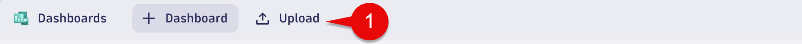
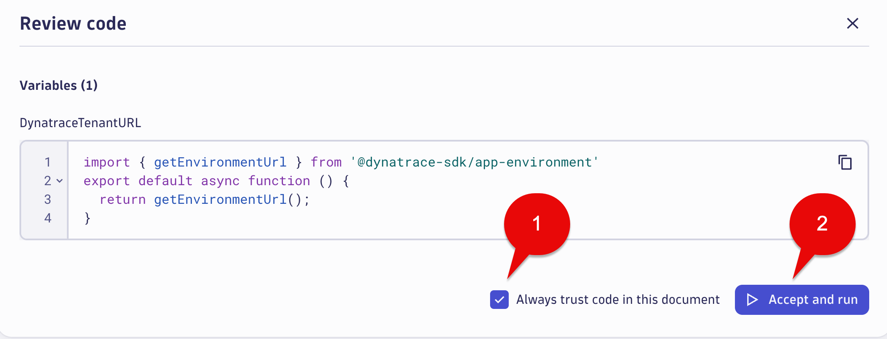
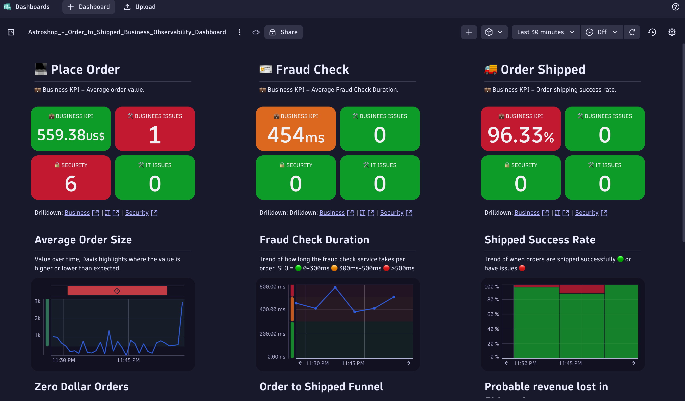
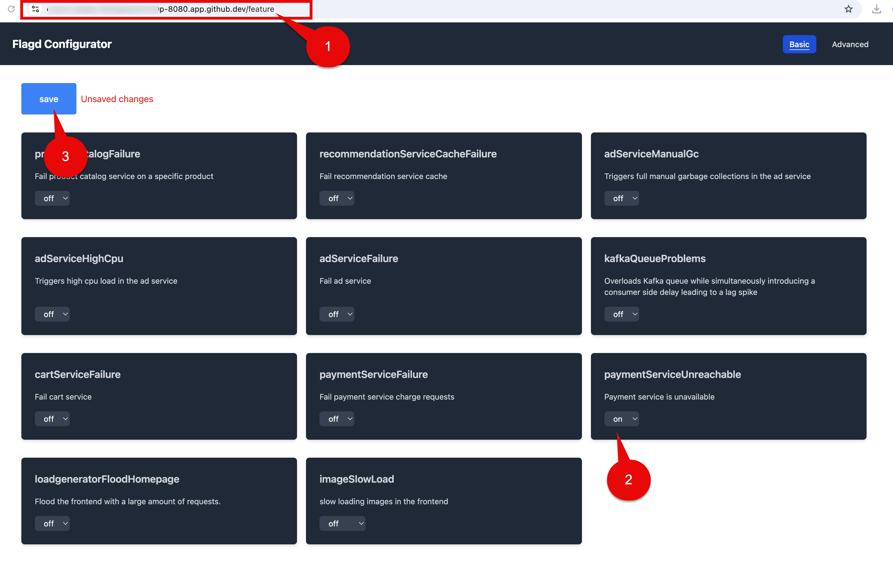
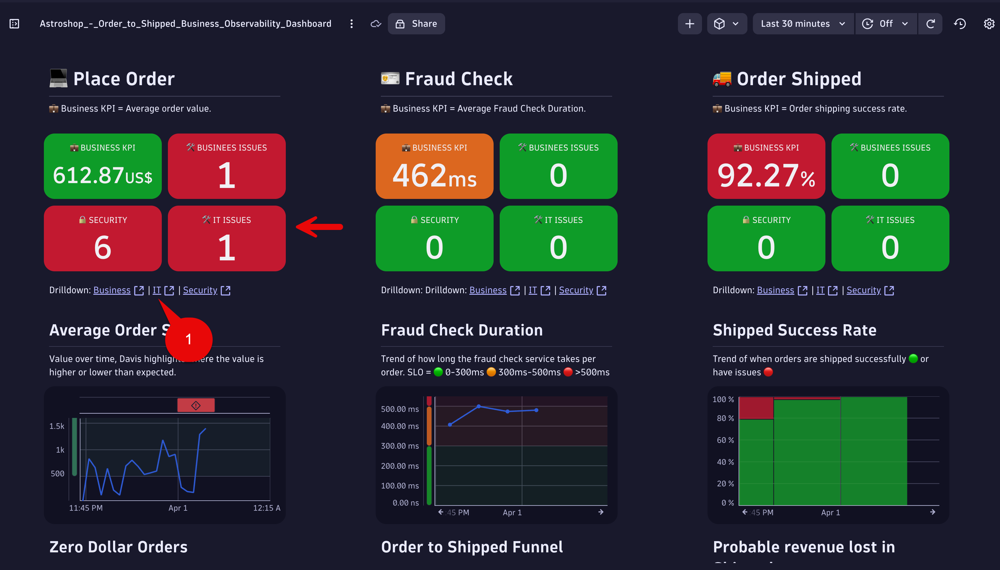
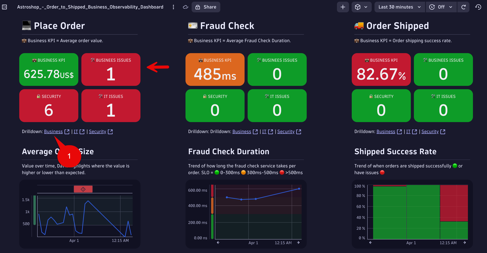
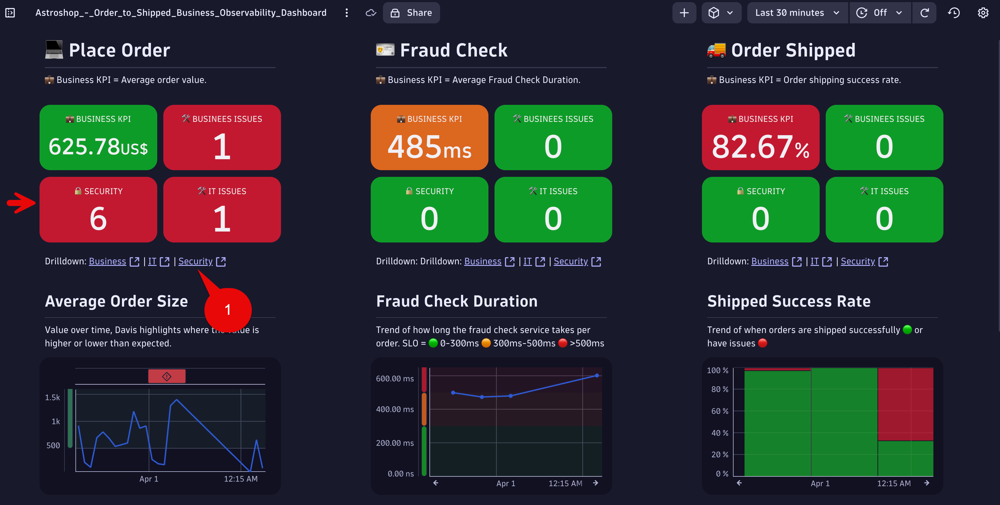
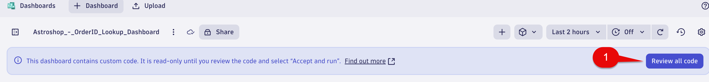
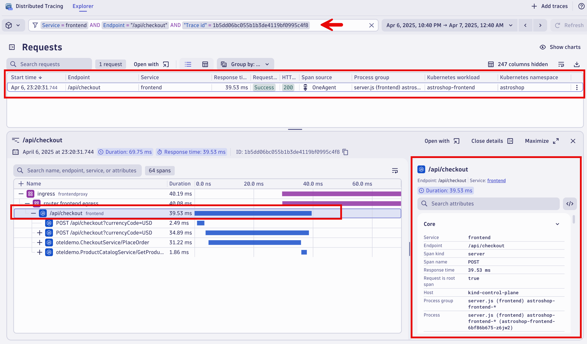

--8<-- "snippets/send-bizevent/bizevent-10-bievents-dashboard.js"

# Dashboards

Supporting customers to order from you and then delivering those products involves not just many of your own systems but also 3rd parties as well. This can make it difficult to understand, for a given customer, just where in this complex process is their order stuck/lost and can be very costly to then either manually retrieve orders or pay compensation to customers.

This particular view is designed to give an end-to-end view of order health, in real-time. The indicators along the top show the health and security of the underlying IT systems, and the Business KPIs can help track metrics which a Business stakeholder would care about.

In this example, we can track things like "Probable lost orders" which haven't progressed through this journey, as well as the financial impact of "Vouchers offered" - where we've felt obliged to offer a discount when people have had issues with orders getting stuck shipping etc.

This view is available, live, in the Playground environment for both internal and customer viewing:

[Retail Order Delivery](https://wkf10640.apps.dynatrace.com/ui/apps/dynatrace.dashboards/dashboard/869f7565-899b-4aa0-91f9-dfeecac7f861#from=-24h&to=now%28%29)


## Business Observability Dashboard

As part of this training we have provided a Business Observability dashboard to upload. 

This dashboard provides a comprehensive, real-time view of your business's key performance indicators (KPIs) and operational health, enabling data-driven decision-making and proactive problem-solving.  

This dashboard encompasses all of the training topics we covered today in a single view.  

The example dashboard is also meant to provide ideas for the Art of the Possible when working with Business Observability uses cases.

### Astroshop - Order to Shipped Business Observability Dashboard - Download

Download the dashboard `Astroshop - Order to Shipped Business Observability Dashboard` using the source file [Astroshop_-_Order_to_Shipped_Business_Observability_Dashboard.json](https://github.com/dynatrace-wwse/enablement-business-observability/blob/main/assets/dynatrace/dashboards/Astroshop_-_Order_to_Shipped_Business_Observability_Dashboard.json) to your local system.

### Astroshop - Order to Shipped Business Observability Dashboard - Upload

Open the `Dashboards` app.

Select the `Upload` button and pick the Astroshop_-_Order_to_Shipped_Business_Observability_Dashboard.json from your local system.



When the Astroshop_-_Order_to_Shipped_Business_Observability_Dashboard first loads a `Review all code` button appears.  

Select the `Review all code` button.


A `Review Code` box will appear.

Select the checkbox for "Always trust code in this document".

Then select the `Accept and run` button.



When uploaded,  you should see all tiles with data.



### Enable IT ISSUES

Wait,  there is more fun!!

Go to your Astroshop UI browser tab.

In the url address bar, append the following to the end of the url.

```txt
/feature
```
Find the `paymentServiceUnreachable` and select the drop down to on.

Then select the `save` button.



Note: Select this link [Astroshop/OpenTelemetry Demo App Feature Flags](https://opentelemetry.io/docs/demo/feature-flags/) for more details on the Feature Flags.

### IT ISSUES - Place Order Step

Within 10 minutes an IT Issue should be opened in the `Place Order` Step section of the dashboard.  You will need to refresh the dashboard as auto-refresh is turned off.   



Click the `IT` link in the drilldown section under the `Place Order` Step.  This will open the IT Problem that was automatically detected by the Davis AI.


### BUSINESS ISSUES - Place Order Step



Click the `Business` link in the drilldown section under the `Place Order` Step.  This will open the Business Problem that was generated from our previous lab, `Avg. duration` greater than 60 seconds for the `Astroshop - Order to Shipped` Business Process.


### SECURITY ISSUES - Place Order Step



Click the `Security` link in the drilldown section under the `Place Order` Step.  This will open all open vulnerabilities for the Astroshop-Frontend workload,  which supports `Place Order` Step of the Business Process.


## Business Observability OrderID Lookup Dashboard

We have provided one more dashboard.  The OrderID Lookup dashboard provides the following:

```txt

Real-time Status KPI's for all Orders

Look up any OrderID and get the status

Filter on all Failed Orders 

Drilldown to Distributed Traces

Context to the health of backend IT Service where Orders start
```
### Astroshop - OrderID Lookup Dashboard - Downlaod

Download the dashboard `Astroshop - OrderID Lookup Dashboard` using the source file [Astroshop_-_OrderID_Lookup_Dashboard.json](https://github.com/dynatrace-wwse/enablement-business-observability/blob/main/assets/dynatrace/dashboards/Astroshop_-_OrderID_Lookup_Dashboard.json) to your local system.

### Astroshop - OrderID Lookup Dashboard - Upload

Open the `Dashboards` app.

Select the `Upload` button and pick the Astroshop_-_OrderID_Lookup_Dashboard.json from your local system.


When the Astroshop_-_OrderID_Lookup_Dashboard first loads a `Review all code` button appears.  

Select the `Review all code` button.



A `Review Code` box will appear.

Select the checkbox for "Always trust code in this document".

Then select the `Accept and run` button.


When uploaded,  you should see all tiles with data.




### Conclusion

We have completed the hands on exercises for the training.  We will now move to the Wrap Up section.

## Continue

In the next section, we'll Wrap Up the Dynatrace Observability Lab.

<div class="grid cards" markdown>
- [Continue to Wrap Up:octicons-arrow-right-24:](11_wrapup.md)
</div>