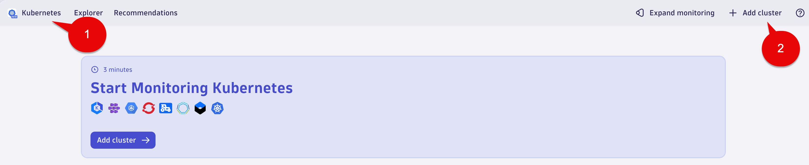
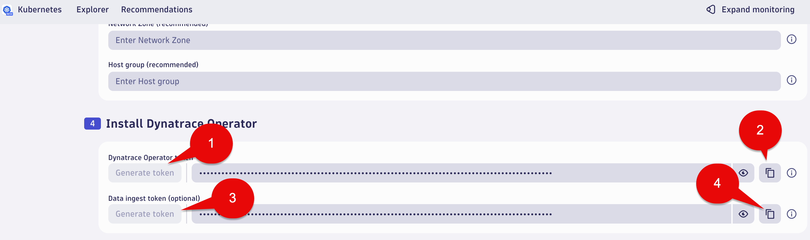
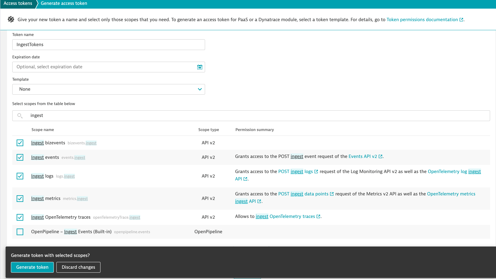

## Dynatrace Tenant Setup

You will need a Dynatrace SaaS tenant.

### Identify Dynatrace SaaS Tenant

Make a note of the Dynatrace environment name. This is the first part of the URL. `abc12345` would be the environment ID for `https://abc12345.apps.dynatrace.com`

* For those running in other environments (such as `sprint`), make a note of your environment: `dev`, `sprint` or `live`

### Enable Node.js Business Event OneAgent Feature

1. Open the Settings Classic App
1. In the tree select Prefences and OneAgent features


3. Filter by

```txt
Node.js Business Events
```

4. Select the sliders to enabled

```txt
Node.js Business Events [Opt-In]
```

```txt
Instrumentation enabled (change needs a process restart)
```

5. Select the Save changes button at the bottom left of the window


### Create Kubernetes Cluster and Operator Token

1. Open the Kubernetes App
2. Select the + Add cluster button
3. Select the Kubernetes platform monitoring + Full-Stack observability radio button
4. Make sure Log Management and Analytics is enabled



5. Under the Configure cluster section use the following:

Cluster name:

```txt
astroshop
```

Network Zone (recommended):

```txt
astroshop
```

Host group (recommended):

```txt
astroshop
```

6. Under the Install Dynatrace Operator section for Dynatrace Operator token, select the Generate token button.

7. Click the copy token icon.  Save the token to your notepad as we will use this later.

`Note:` We don't need the Data ingest token (optional).   We will be creating an Ingest token in the next steps that will have more scope and will include the data ingest scope needed.



### Create DT API Token

Create a Dynatrace access token with the following permissions. This token will be used by the setup script to automatically create all other required DT tokens.

1. `Ingest bizevents`
1. `Ingest events`
1. `Ingest logs`
1. `Ingest metrics`
1. `Ingest OpenTelemetry traces`
1. `PaaS integration - Installer download`

Save the token to your notepad as we will use this later.



You should now have 4 pieces of information:

1. A DT environment (`dev`, `sprint` or `live`)
1. A DT environment ID
1. A DT Kubernetes Operator token
1. An API token