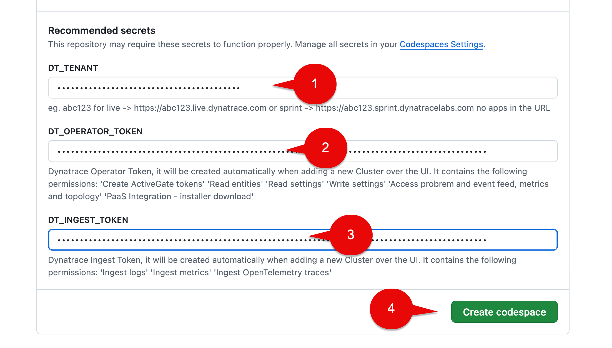
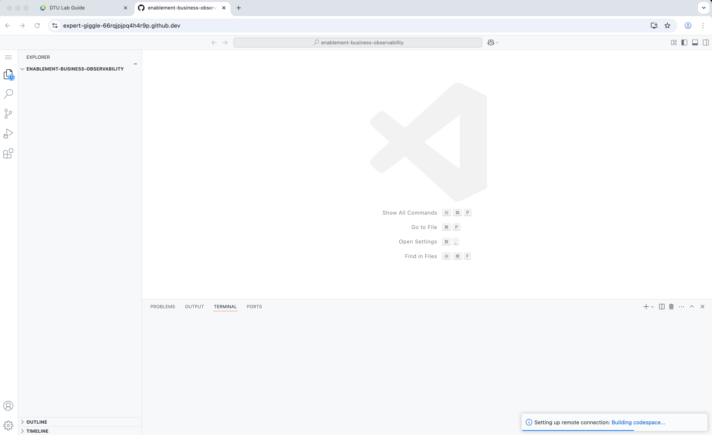
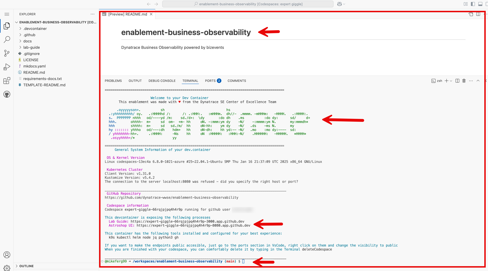
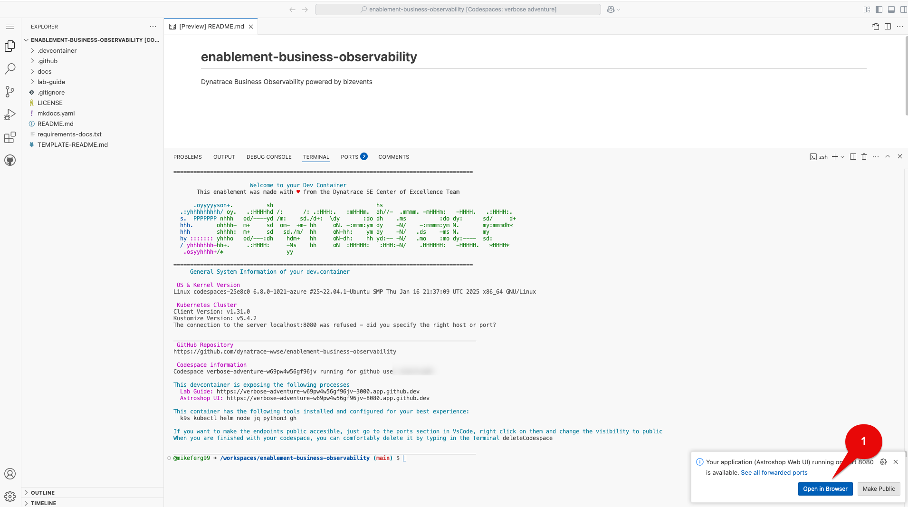
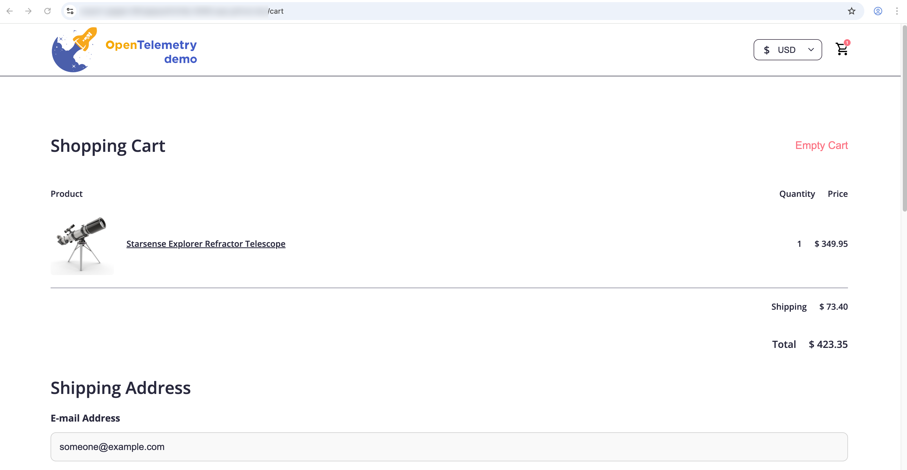
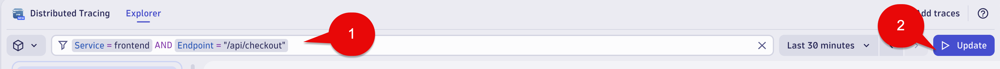
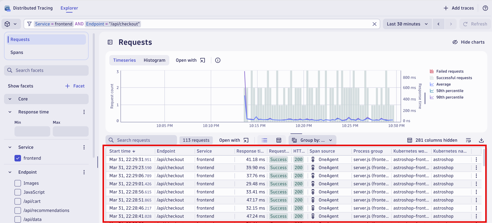
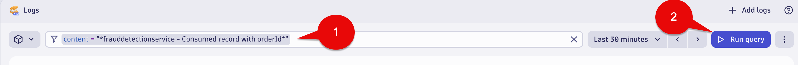
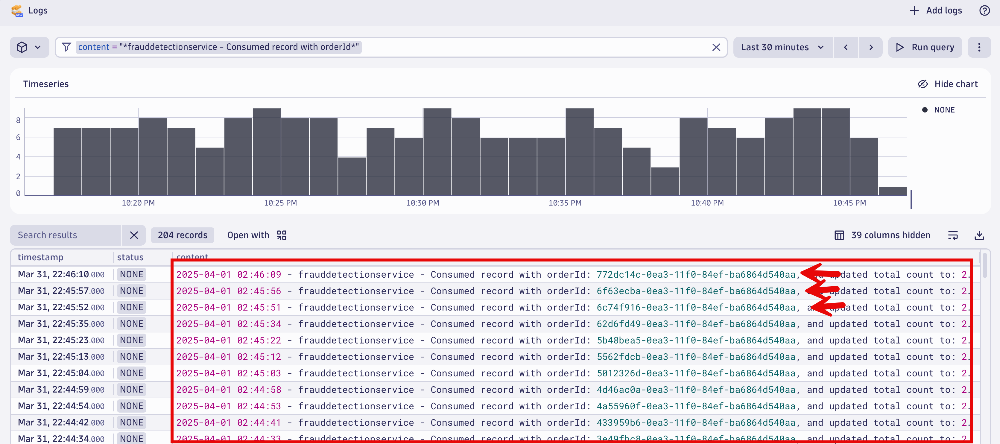

## GitHub Repository Setup

You will need a GitHub account.

The source repository for this lab is: 

[enablement-business-observability](https://github.com/dynatrace-wwse/enablement-business-observability)

Open the link above in your browser.

## Codespaces Cluster Set Up

Click on `Code`.  Click on `Codespaces`.  Click on `New with options`.


Choose the Branch `main`.  

Choose the Dev Container Configuration `Enablement Business Observability`.

Choose a region close to your Dynatrace tenant. If you run into issues with spinning up your codespaces instance, try selecting a different region.

Choose Machine Type `4-core`.


Fill in recommend secrets sections for the following that you have in your saved notepad:

```txt
* DT_TENANT

* DT_OPERATOR_TOKEN

* DT_INGEST_TOKEN
```
When done select the Create codespace button.



If you have already defined the environment variables in your repository, you'll see a screen asking you to associate those secrets with this repository. 

You can either update or delete those existing secrets.  If you delete the secretes, you will need to start over.

If you want to update those secretes, click the Codespaces Settings link in the Recommended secrets section of this page.  This open up a new window for Codespace user secrets section for your account.  For each of the secrets below, edit with the pencil icon,  update with the values for collected for this lab and save changes.   

```txt
* DT_TENANT

* DT_OPERATOR_TOKEN

* DT_INGEST_TOKEN
```
Then code back to you codespace setup page you have open and boxes as shown below.

When done select the Create codespace button.


## Codespaces Codespace Instance

Your browser tab will change to the Codespace initialize screen.

Allow the Codespace instance to fully initialize.  It is not ready yet.

It will take about 10 minutes to fully finish.

During the initialize phase you will see:



The Codespace instance will run the post initialization scripts.


Again, it will take about 10 minutes to fully finish...give it time!

When fully finished you see below.



## Astroshop Validation

In the Codespace window,  you will see a section called: 

```txt
This devcontainer is exposing the following processes
```
In the  `Astroshop UI` section,  cmd + click the url or copy and paste the url in a new browser tab.  This will launch `Astroshop UI`.


If you caught in time you could also select the Open in Browser pop up at the very bottom right of the screen to Launch Astroshop.   Either approach works!



Take a minute to navigate around.



## Dynatrace Data Validation - Distributed Traces

Open the `Distributed Tracing` app.

In the filter section copy and paste this below:

```txt
Service = frontend AND Endpoint = "/api/checkout"
```

Select the `Update` button.



Validate you see traces for "/api/checkout".



Select a single trace to see the single trace details.


## Dynatrace Data Validation - Logs

Open the `Logs` app.

In the filter section copy and paste this below:

```txt
content = "*frauddetectionservice - Consumed record with orderId*" AND Endpoint = "/api/checkout"
```

Select the `Run query` button.



Validate you see log lines for "frauddetectionservice - Consumed record with orderId:".



### Conclusion

We have completed the step of Codespaces setup,  verified Astroshop is running,  verified the Distributed traces and Log lines needed are being consumed.  We are ready to move to the Hands on Labs!!