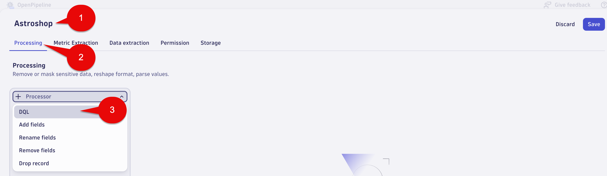
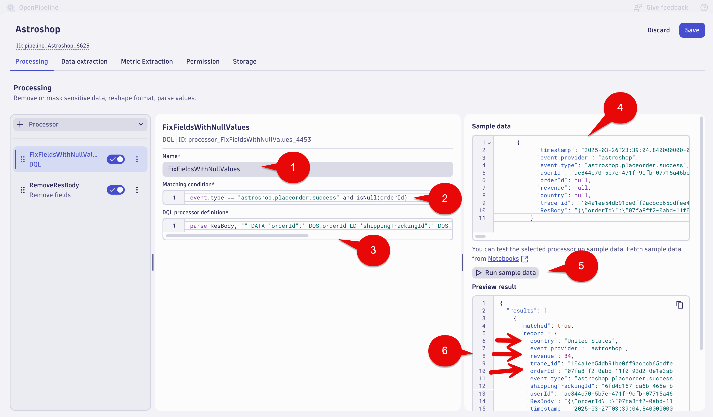
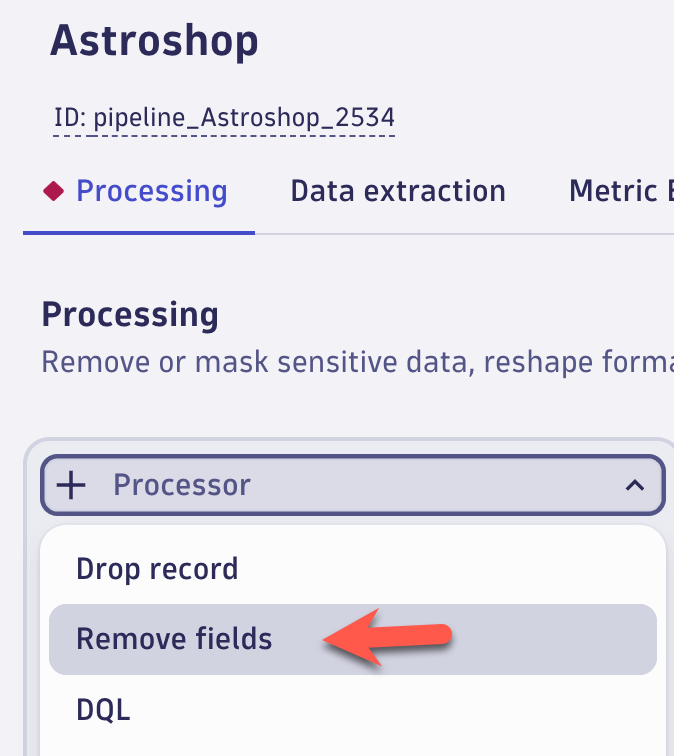
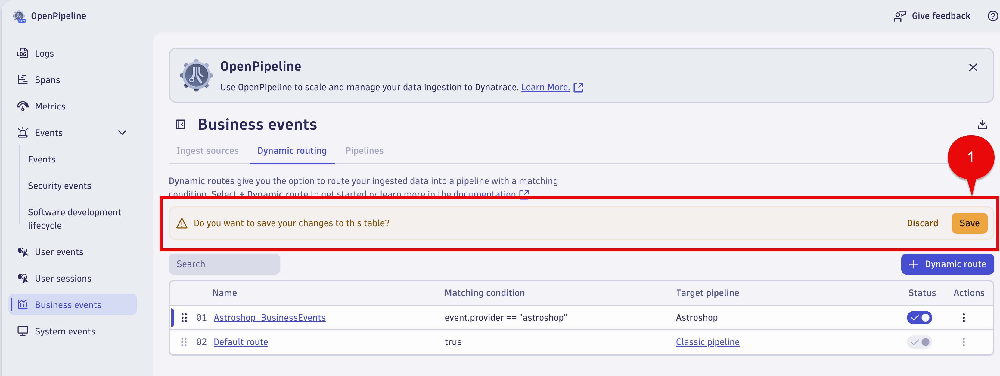

## OpenPipeline

In this section of the lab we will use OpenPipeline to replace the  `orderId`, `revenue`, `country` fields values when they are null. We will use the `ResBdy` field to extract the correct values needed for the `Place Order` Business Event.

## Business Events - OpenPipeline - Place Order

1. Launch the OpenPipeline app

2. Select `Business events` in the OpenPipline tree

3. Select `Pipelines` tab

4. Select the `+ Pipeline` button


## Business Events - OpenPipeline - Processing - Place Order

1. Name your OpenPipeline rule using the following name: 

```text
Astroshop
```

2. Select the `Processing` tab

3. Select the `+ Processor` button on the left and select `DQL`



4. Fill out the fields with the following data:

Name: 

```text
FixFieldsWithNullValues
```

Matching condition: 

```text
event.type == "astroshop.placeorder.success" and isNull(orderId)
```

DQL processor definition: 

```txt
parse ResBody, """DATA 'orderId":' DQS:orderId LD 'shippingTrackingId":' DQS:shippingTrackingId LD 'units":' DOUBLE:revenue LD  LD 'country":' DQS:country"""
```

Sample data:

```txt
{
      "orderId": null,
      "ResBody": "{\"orderId\":\"5404d0d7-086c-11f0-895b-0e326b3139ca\",\"shippingTrackingId\":\"c564bb96-9d8e-4e88-b869-a1b64278beb6\",\"shippingCost\":{\"currencyCode\":\"USD\",\"units\":172,\"nanos\":800000000},\"shippingAddress\":{\"streetAddress\":\"One Microsoft Way\",\"city\":\"Redmond\",\"state\":\"WA\",\"country\":\"United States\",\"zipCode\":\"98052\"},\"items\":[{\"cost\":{\"currencyCode\":\"USD\",\"units\":349,\"nanos\":949999999},\"item\":{\"productId\":\"66VCHSJNUP\",\"quantity\":3,\"product\":{\"id\":\"66VCHSJNUP\",\"name\":\"Starsense Explorer Refractor Telescope\",\"description\":\"The first telescope that uses your smartphone to analyze the night sky and calculate its position in real time. StarSense Explorer is ideal for beginners thanks to the app\u0019s user-friendly interface and detailed tutorials. It\u0019s like having your own personal tour guide of the night sky\",\"picture\":\"StarsenseExplorer.jpg\",\"priceUsd\":{\"currencyCode\":\"USD\",\"units\":349,\"nanos\":950000000},\"categories\":[\"telescopes\"]}}}]}"
}
```

5. Select the `Run sample data` button

6. Under the `Preview result` section validate `orderId`, `country` and `revenue` fields have values.



## Business Events - OpenPipeline - Processing - Remove ResBody Field

1. Select the `+ Processor` button on the left and select `Remove fields`



2. Fill out the fields with the following data:

Name: 

```text
RemoveResBody
```

Matching condition: 

```text
event.type == "astroshop.placeorder.success"
```

Remove fields:

After adding the below field to remove, select the Add button

```text
ResBody
```

3. Select the Save Button at the top right of the screen


## Business Events - OpenPipeline Dynamic Route - Place Order

Now we need to create a Dynamic route for the Astroshop pipeline. Dynamic routes give you the option to route your ingested data into a pipeline with a matching condition.

1. Select `Business events` in the OpenPipline tree 

2. Select `Dynamic routing` tab

3. Select `+ Dynamic route` button


4. Configure the Dynamic route with the following

Name:

```text
Astroshop_BusinessEvents
```

Matching condition:

```text
event.provider == "astroshop"
```

Pipeline:

In the dropdown list select the following

```text
Astroshop
```

4. Select the `Add` button


5.  Select the `Save` button

```text
A warning icon with this message will appear "Do you want to save your changes to this table?" 
```
Select the `Save` button



### Conclusion

We have completed the Business Event OpenPipeline section for `Placer Order` step  of the `Order to Shipped` business process.  This section covered how to use OpenPipleline to replace the null value fields for  `orderId`, `revenue`, `country` with the correct values. In the next section we will validate the data using the `Notebook's App`.