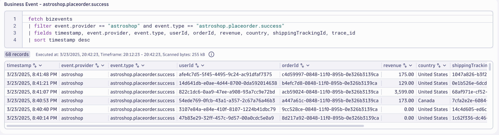

## Data Validation

In this section of the lab we will validate the data for the `Place Order` step of the `Order to Shipped` business process.

### Query Business Events in Dynatrace

Using the Notebook's App, execute the below DQL query, which retrieves the buisness events for `astroshop.placeorder.success` step.  

DQL:
```sql
fetch bizevents
| filter event.provider == "astroshop" and event.type == "astroshop.placeorder.success"
| fields timestamp, event.provider, event.type, userId, orderId, revenue, country, shippingTrackingId, trace_id
| sort timestamp desc
```

Result:



### Conclusion

We have completed data validation for the `Place Order` step of the `Order to Shipped` business process.