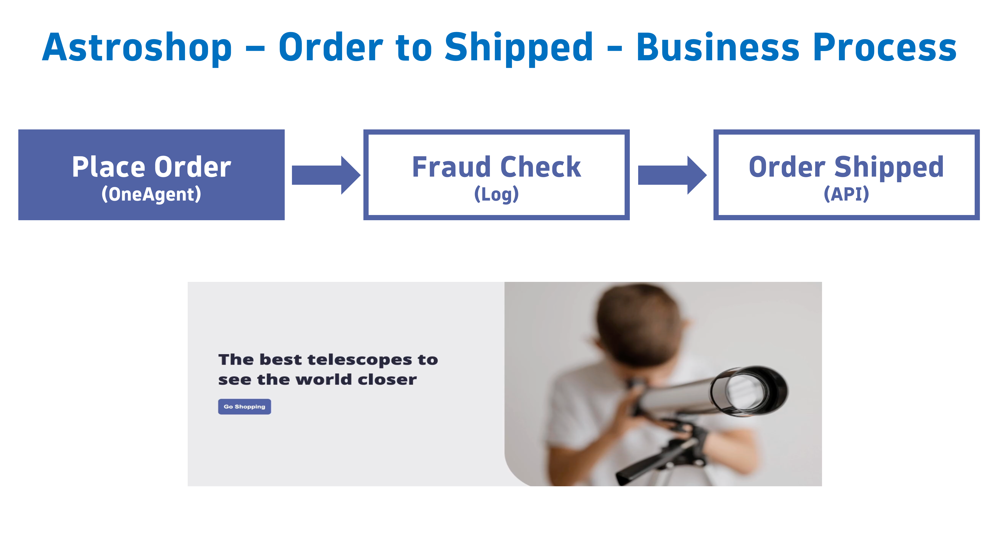

## Business Events Capture - OneAgent

Using the Dynatrace OneAgent to capture Business Events provides real-time business observability, enabling data-driven decision-making and improved business outcomes by offering precise metrics and context, lossless access to data, and the ability to explore large datasets without pre-indexing.

* Recommended approach for capturing Business Events when applicable

* Uses deep payload inspection extracts business data from in-flight application requests and responses

* Configuration is simple and doesn’t require code changes

* Automatically enriches business events with context, including host, process group, and trace information, which helps in analyzing anomalies and fostering collaboration

[Get business events via OneAgent documentation](https://docs.dynatrace.com/docs/shortlink/ba-business-events-capturing#report-business-event-oneagent)

This lab will utilize the Dynatrace OneAgent to capture business events for the `Place Order` step of the Astroshop `Order to Shipped` business process.

* Configure a capture rule, triggers and data fields to be extracted
* Use OpenPipeline to extract and remove fields
* Validate Business Event data with a Notebook

