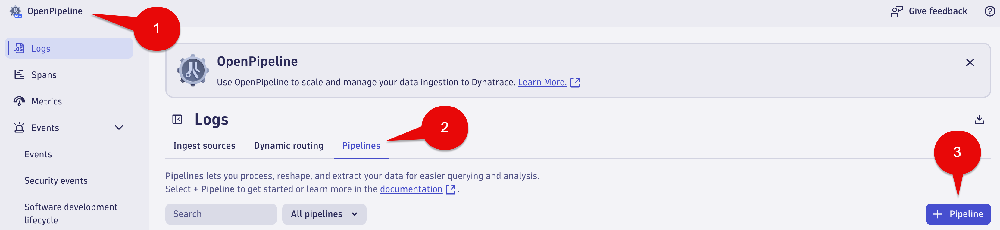
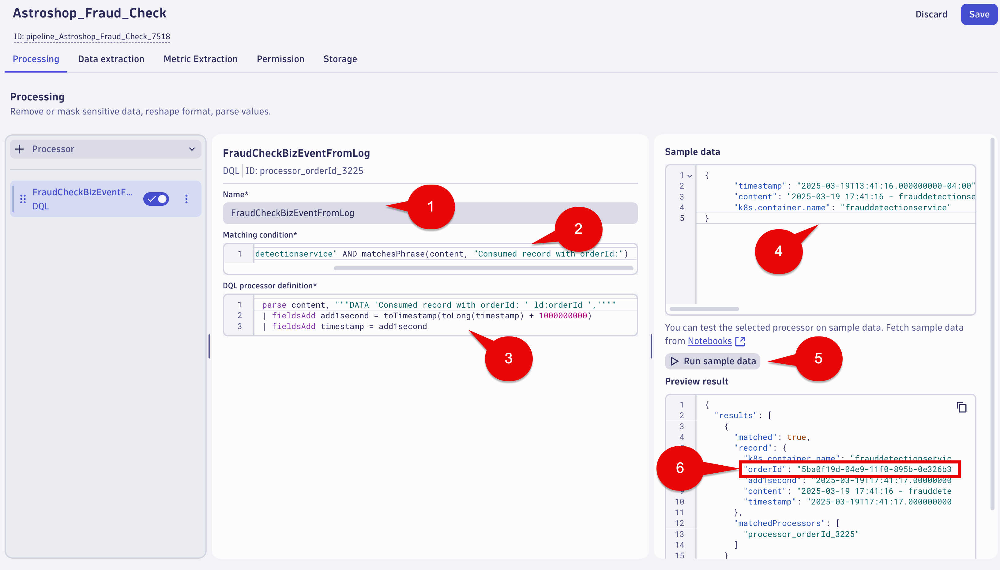

## Fraud Check

In this section of the lab we will use OpenPipeline to convert incoming logs to business events or `Fraud Detection` step of the `Order to Shipped` business process. 

This approach is useful if logs contain business-relevant information or no other ingest path for business events is available.

### Logs - Fraud Check

In the Notebook App, execute the below DQL query, which retrieves the buisness events that will be used for the `Fraud Check` step of the `Order to Shipped` business process.

DQL:
```sql
fetch logs
| filter k8s.container.name == "frauddetectionservice"
| filter matchesPhrase(content, "Consumed record with orderId:")
| filter matchesPhrase(content, "orderId")
| fields timestamp, content
| sort timestamp desc
```

Result:


## Logs - Fraud Check orderID Extraction

In the Notebook App, execute the below DQL query, which retrieves the buisness events that will be used for the `Fraud Check` step of the `Order to Shipped` business process and parses the logs line to extract the orderId that will be import when we convert this to a business event.

DQL:
```sql
fetch logs
| filter k8s.container.name == "frauddetectionservice"
| filter matchesPhrase(content, "Consumed record with orderId:")
| parse content, """DATA 'Consumed record with orderId: ' ld:orderId ','"""
| fields timestamp, orderId, content
| sort timestamp desc
```
Result:


## Business Event - OpenPipeline - Fraud Check

1. Launch the OpenPipeline app

2. Go to Logs and select the Pipelines tab

3. Select the + Pipeline button



## Business Event - OpenPipeline Processing - Fraud Check

1. Name your OpenPipeline rule using the following name: 

```text
Astroshop_Fraud_Check
```

2. Select the `Processing` tab

3. Select the `+ Processor` button on the left and select DQL


4. Fill out the fields with the following data:

Name: 

```text
FraudCheckBizEventFromLog
```

Matching condition: 

```text
k8s.container.name == "frauddetectionservice" AND matchesPhrase(content, "Consumed record with orderId:")
```

DQL processor definition: 

```text
parse content, """DATA 'Consumed record with orderId: ' ld:orderId ','"""
| fieldsAdd add1second = toTimestamp(toLong(timestamp) + 1000000000)
| fieldsAdd timestamp = add1second
```

5. In the sample data section use the following:

```json
{
      "timestamp": "2025-03-19T13:41:16.000000000-04:00",
      "content": "2025-03-19 17:41:16 - frauddetectionservice - Consumed record with orderId: 5ba0f19d-04e9-11f0-895b-0e326b3139ca, and updated total count to: 1126 trace_id=6cd0e9c60fd10799c66eb344f916d7e6 span_id=3173a5d07a507a1d trace_flags=01 ",
      "k8s.container.name": "frauddetectionservice"
}
```
6. Run sample data and Preview the result.  

7. Validate the orderId field exists in the results



## Business Event - Data extraction - Fraud Check

1. Select the `Data extraction` tab

2. Select the `+ Processor` button on the left and select Business event


3. Fill out the fields with the following data:

Name:

```text
orderId
```

Matching condition:

```text
k8s.container.name == "frauddetectionservice" AND matchesPhrase(content, "Consumed record with orderId:") and isNotNull(orderId)
```

Event type:

Select the Static string radio button and use the following:

```text
astroshop.fraudcheck.success
```

Event provider:

Select the Static string radio button and use the following:

```text
astroshop
```

Field extraction: 

Select the Fields to extract radio button.  We will add 3 fields to extract.  The fields need to be added seperately.

Click the Add button for:

```text
timestamp
```

Click the Add button for:

```text
orderId
```
Click the Add button for:

```text
trace_id
```

4. Select the Save Button at the top right of the screen


We have completed the Business Event capture for `Fraud Check` step  of the `Order to Shipped` business process.  In the next section we will validate the data using the `Notebook's App`.