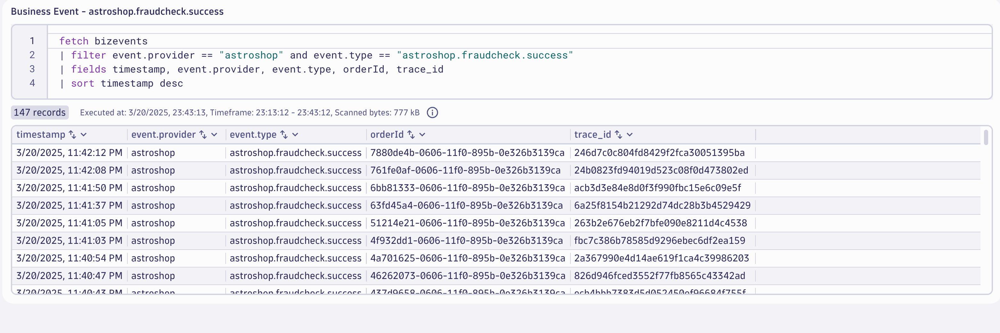

## Data Validation

In this section of the lab we will validate the data for the `Fraud Check` step of the `Order to Shipped` business process.

### Query Business Events in Dynatrace

Using a Notebook execute the below DQL query which retrieves the buisness events for `astroshop.fraudcheck.success` step.  Note, this may take 3-5 minutes for new data to appear.

DQL:
```sql
fetch bizevents
| filter event.provider == "astroshop" and event.type == "astroshop.fraudcheck.success"
| fields timestamp, event.provider, event.type, orderId, trace_id
| sort timestamp desc
```

Result:



### Conclusion

We have completed data validation for the for the `Fraud Check` step of the `Order to Shipped` business process.