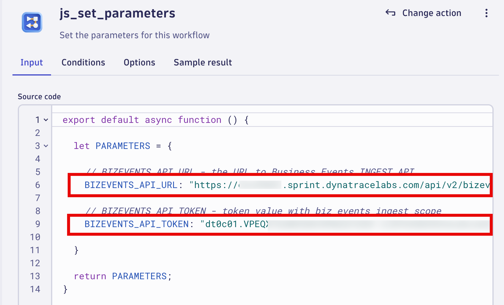

## Order Shipped

In this section of the lab we will use a Dynatrace Workflow to send simulated events that represent the Astroshop Shipping system when an Order is shipped.  These events will leverage the Business Events API for the `Order Shipped` step of the Astroshop `Order to Shipped` business process.  

### Workflow - Import

1.  Open the Dynatrace Workflow app

2.  Import the workflow 'Astroshop - Order Shipped' using the source file [Astroshop - Order Shipped](https://github.com/dynatrace-wwse/enablement-workflow-essentials/blob/main/lab-guide/assets/lab-guide/assets/dt_wftpl_astroshop_-_order_shipped.yaml)

3.  Workflows are imported using the Upload button.  Upload the `Astroshop - Order Shipped` workflow from your local system, the select `Import` button.


###  Workflow - js_set_parameters

1. Select the `js_set_parameters`

`Note:` Good best practice for any workflow you create. This will be the task/action that defines the parameters/variables that will be used by subsequent tasks and returns them in the result. By setting the parameters as nested attribute key:value pairs within a single variable, as additional parameters are needed they can easily be added without modifying any other code.

2. In the `Input section` set the values of the missing variables wiht the following:

-  BIZEVENTS_API_URL:

    * Replace `<tenant-id-env>` with your Dynatrace environment ID and Env
    
    ```txt
    Prod Example:   `xxxxxx.live.dynatrace.com`  
    Sprint Example: `xxxxxx.sprint.dynatracelabs.com`
    ```

- BIZEVENTS_API_TOKEN:

    * Use the API token we created in the Environment Setup


Example should look like below:



###  Workflow - Enable and Save

1. Enable the `Event Trigger` flow

2. Select Save button


###  Workflow - Review

We will review the task(s)/action(s) of the `Astroshop - Order Shipped` Workflow.  As discussed above, the workflow is sending simulated events that represent the Astroshop Shipping system when an Order is shipped.

The most important task/action of this workflow is `insert_biz_event` task/action.  The included parameters match the required paramaters as if your customer was sending Business Events programatically from their Environment/System to Dynatrace Business Events API.

Below are the settings used in the `insert_biz_event` task/action of the `Astroshop - Order Shipped` workflow.


[Business Events API Documenation](https://docs.dynatrace.com/docs/shortlink/ba-api-ingest#ingest-endpoint)


###  Workflow - Validate


### Conclusion

We have completed the step of using a Dynatrace Workflow to send simulated events that represent the Astroshop Shipping system when an Order is shipped.  In the next section we will validate `Order Shipped` step of the `Order to Shipped` business process Business Events are being generated using the `Notebook's App`.