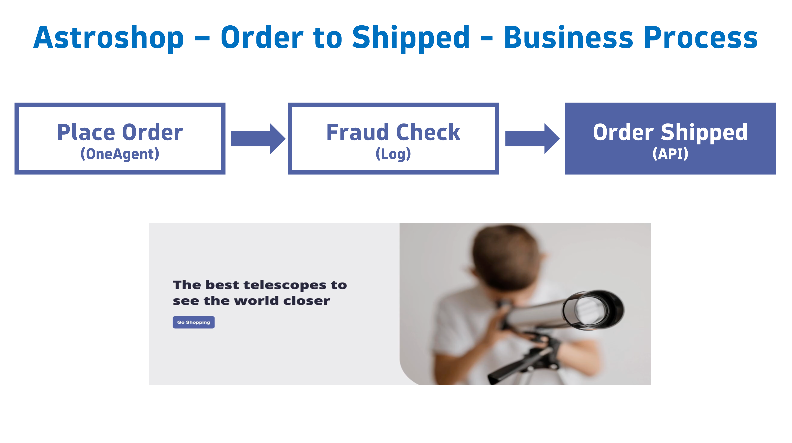

## Business Event Capture - API

This lab will utilize data sent to Business Events API to capture a business event for the `Order Shipped` step of our Astroshop `Order to Shipped` business process.

* Use a workflow to send `Order Shipped` business events to the Business Events API 
* Validate the data using a Notebook

