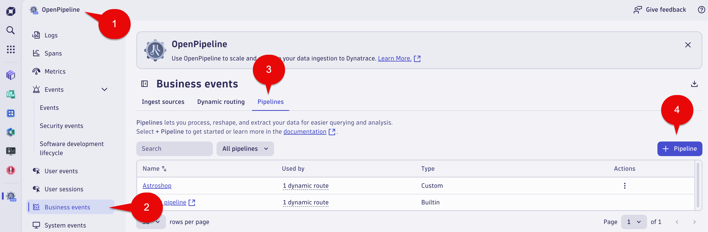

## Place Order Metric

In this section of the lab we will create a count metric for `Place Order` step.  We also want to report by Country.

## Business Metric - OpenPipeline - Place Order

1. Launch the OpenPipeline app

2. Select `Business events` in the OpenPipline tree

3. Select `Pipelines` tab

4. Select the `+ Pipeline` button



## Business Metric - OpenPipeline Processing - Place Order

1. Name your OpenPipeline rule using the following name: 

```text
Astroshop
```

2. Select the `Metric Extraction` tab

3. Select the `+ Processor` button on the left and select `Counter metric`

`Note`: 

* `Counter metric` 

```text
Where you want to only count the number `Place Order` occurrences.
```

* `Value metric` 

```text
Where you want to report on `Revenue`. The revenue field captured in the `Place Order` 
Business Event data would be extracted and used as the metric value. 
```


4. Fill out the fields with the following data:

Name: 

```text
OrderShippedSucccess
```

Matching condition: 

```text
event.provider == "astroshop" and event.type == "astroshop.placeorder.success"
```

Dimensions: 

Select the Custom radio button.

For both `Field name on record` and `Dimension name` sections use:

```text
country
```

Click the `Add dimension` button.  This will add both fields. 

4. Select the Save Button at the top right of the screen


## Business Metric - OpenPipeline Dynamic Route - Place Order

Now we need to create a Dynamic route for the Astroshop pipeline. Dynamic routes give you the option to route your ingested data into a pipeline with a matching condition.

1. Select `Business events` in the OpenPipline tree 

2. Select `Dynamic routing` tab

3. Select `+ Dynamic route` button


4. Configure the Dynamic route with the following

Name:

```text
Astroshop_BusinessEvents
```

Matching condition:

```text
event.provider == "astroshop"
```

Pipeline:

In the dropdown list select the following

```text
Astroshop
```

4. Select the `Add` button


5.  Select the `Save` button

```text
A warning icon with this message will appear "Do you want to save your changes to this table?" 
```
Select the `Save` button


### Conclusion

We have completed the Business Metric capture for `Placer Order` step  of the `Order to Shipped` business process.  In the next section we will validate the data using the `Notebook's App`.