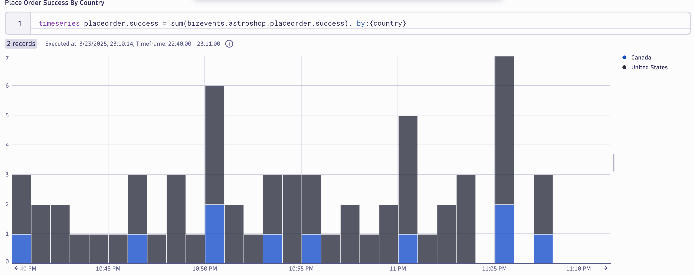

## Data Validation

In this section of the lab we will validate the data for the `Place Order` business metric.   We also want to see it broken out by country.

### Query Business Metric in Dynatrace

Using a Notebook execute the below DQL query which retrieves the business metric `bizevents.astroshop.placeorder.success` split by country.  Note, you shoud see data within 3-5 minutes.

DQL:
```sql
timeseries placeorder.success = sum(bizevents.astroshop.placeorder.success), by:{country}
```

Result:



### Conclusion

We have completed data validation for the `Place Order` business metric.