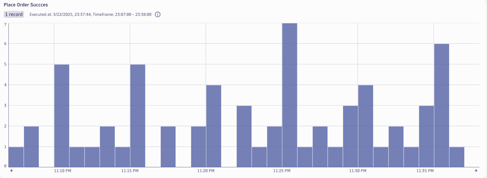

## Business Events - Metric

Business event metric extraction is a convenient way to create your own business metrics. 

It enables you to:

* To use with Dashboards and Notebooks for real-time monitoring and historical data analysis 
* Alerting, such as when a certain value surges or drops 

This lab will utilize OpenPipeline to make a business metric from business events for the `Place Order` step of the Astroshop `Order to Shipped` business process.

