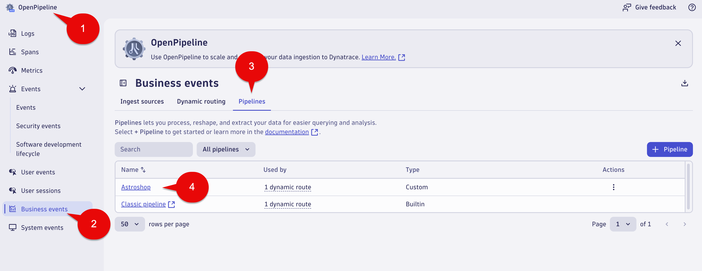

## Business Alert

In this section of the lab we will create an alert for `Place Order` Business Events that have revenue = 0.

Examples of where this could occur:

* Manual Data Entry
* Different Coding Systems
* Bidirectional Syncing

## Business Alert - OpenPipeline - Place Order

1. Launch the OpenPipeline app

2. Select `Business events` in the OpenPipline tree

3. Select `Pipelines` tab

4. Select the `Astroshop` Pipeline



## Business Alert - OpenPipeline - Data extraction - Place Order

1. Select `Data extraction` tab

2. Fill out the fields with the following data:

Name: 

```text
OrdersWithZeroValues
```

Matching condition: 

```text
event.provider == "astroshop" and event.type == "astroshop.placeorder.success" and revenue == 0"
```

Event template: 

```text
Astroshop - Orders with Zero Values
```

Event description: 

```text
This can occur when data synchronization failures occur between the Astroshop inventory system and website. Please treat this a P1!
```

Event properties:

Davis events are enriched with additional fields, as detailed in the [Davis event model documentation](https://docs.dynatrace.com/docs/shortlink/semantic-dictionary-davis-ai#event).

```text
The event.type, event.name and event.description sections should be 
pre-filled from the previous entries you configured above.  Nothing should 
be needed for these fields.
```

Please add new entries for Event properties section using the following:

```text
Left side name:     dt.davis.timeout
Right side value:   10
```

```text
Left side:          dt.davis.is_merging_allowed 
Right side value:   true
```

```text

Left side name:     dt.source_entity 
Right side value:   {dt.entity.process_group}
```

4. Select the Save Button at the top right of the screen


### Conclusion

We have completed the for `Place Order` Business Alert.  In the next section we will validate the data using the `Problems's App`.

