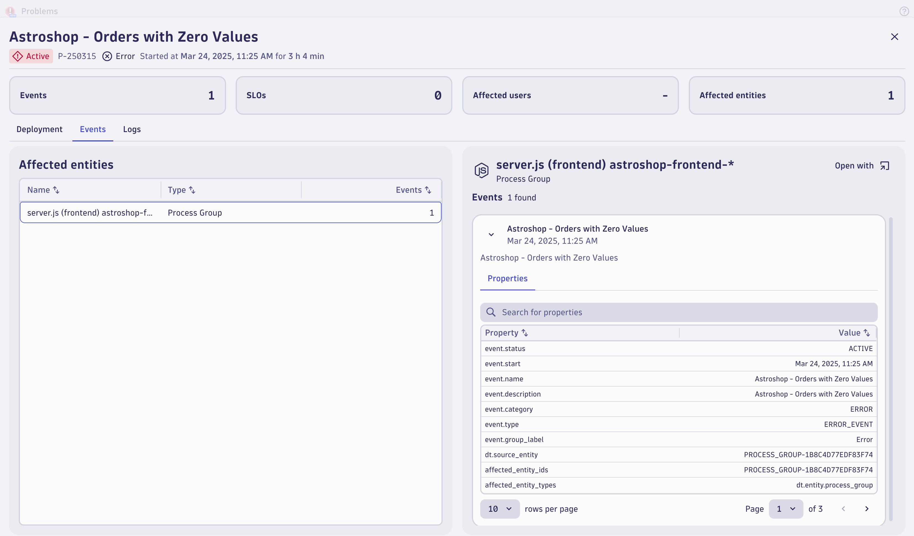

## Data Validation

In this section of the lab we will validate the data for the `Place Order` Business Alert was fired.   

### Problems App

Open Problems's App,  you should see `Astroshop - Orders with Zero Values` problem generated.   This may take a few minutes. We can come back to this data validation after the next section if needed.

### Conclusion

We have completed data validation for the `Place Order` business alert.