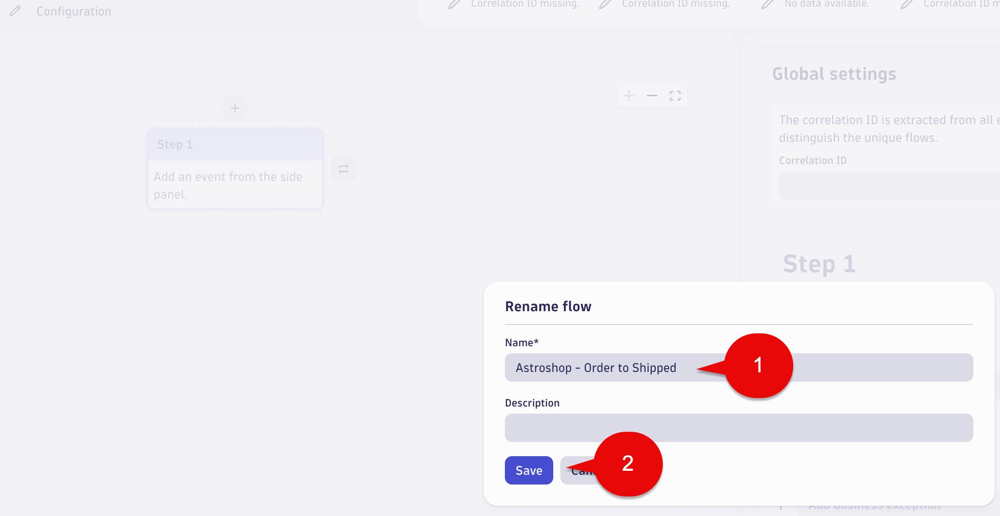
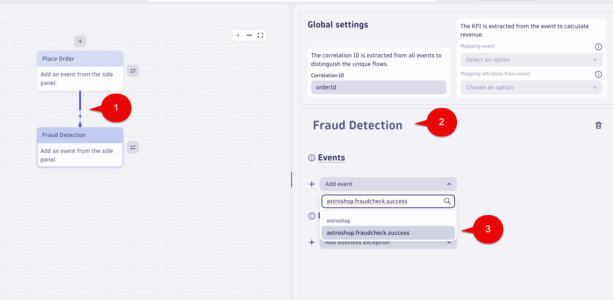
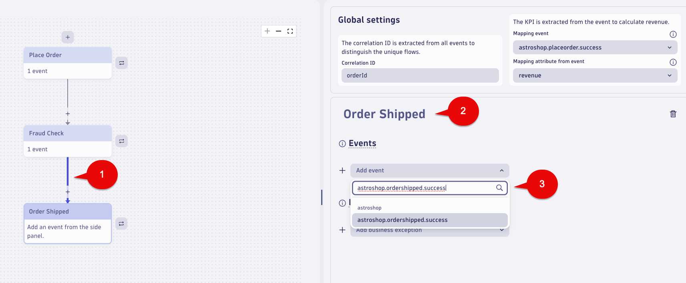
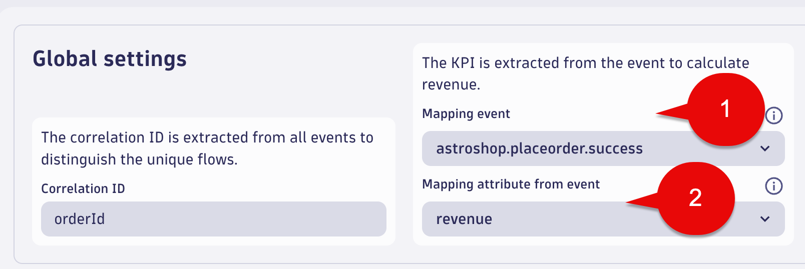
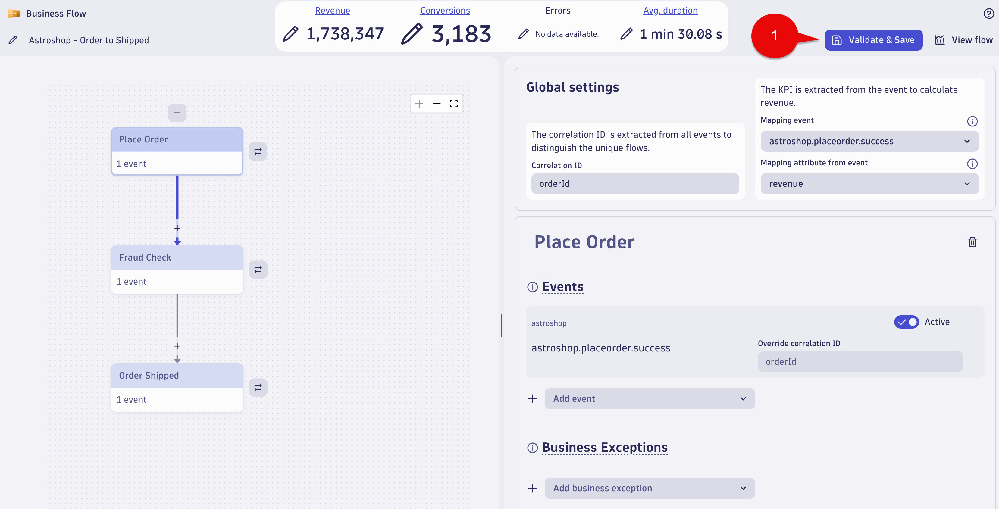

## Business Flow
  
In this section of the lab we will create a Business Flow using the Business Events we have defined for the Astroshop `Order to Shipped` business process.

## Business Flow - Order to Shipped - Configuration Name

Launch the Business Flow app.

Select `+ Business Flow ` to get to the configuration page.


Select the Pencil icon at the top left and rename the Configuration using the following:

Name:

```txt
Astroshop - Order to Shipped
```

Select the Save button.



## Business Flow - Place Order Step

For `Step 1` configuration use the following:

Name - (click the Step 1 box to edit):

```txt
Place Order
```

Drop-down event box:

```txt
astroshop.placeorder.success
```


After picking `astroshop.placeorder.success`, the `Place Order` step should look like this below:


## Business Flow - Fraud Check Step

Click the `Place Order` step.  

Select the + button on the bottom.  

This will add a new step under the `Place Order` called `Step 2`. 

For `Step 2` configuration use the following:

Name - (click the Step 2 box to edit):

```txt
Fraud Check
```

Drop-down event box:

```txt
astroshop.fraudcheck.success
```



After picking `astroshop.fraudcheck.success`, the `Fraud Check` step should look like this below:


## Business Flow - Order Shipped Step

Click the `Fraud Check` step.  

Select the + button on the bottom.  

This will add a new step under the `Fraud Check` called `Step 3`.

For `Step 3` configuration use the following:

Name - (click the Step 3 box to edit):

```txt
Order Shipped
```

Drop-down event box:

```txt
astroshop.ordershipped.success
```



After picking `astroshop.ordershipped.success`, the `Order Shipped` step should look like this below:


## Business Flow - Correlation ID

In the Global settings section use the following for the `Correlation ID` field:

```txt
orderId
```


## Business Flow - KPI

For the KPI is extracted from the event to calculate revenue field, use the following:

Mapping event dropdown list pick:

```txt
astroshop.placeorder.success
```

Mapping attribute from event dropdown list pick:

```txt
revenue
```



## Business Flow - Validate & Save

Select the `Validate & Save` button at the top right of the screen.



## Business Flow - View flow

Select the `View flow` button at the top right of the screen.


### Conclusion

We have completed the Business Flow configuration for the Astroshop `Order to Shipped` business process. The next section will validate the data.