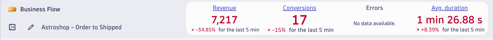
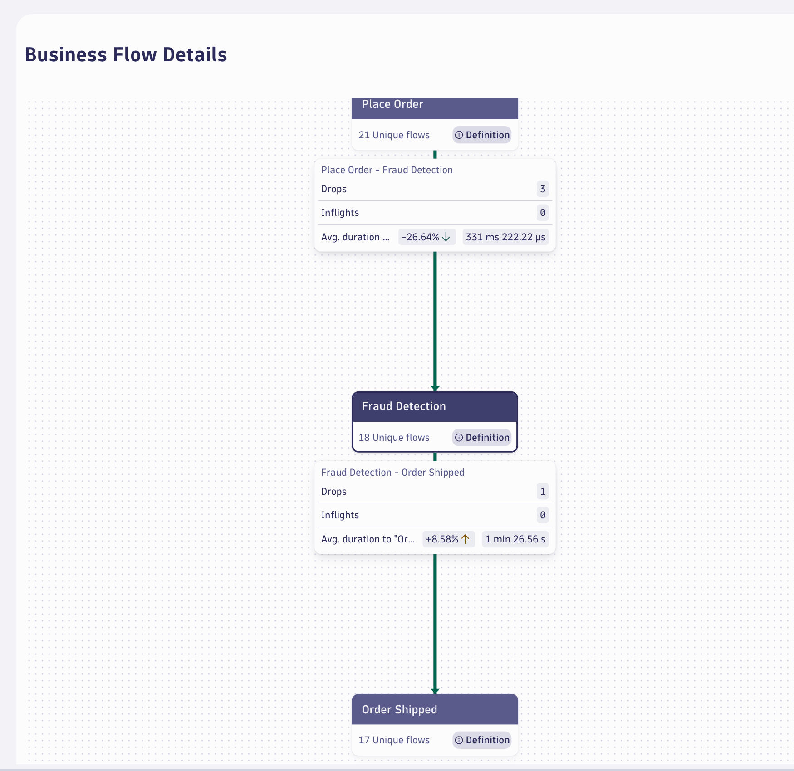
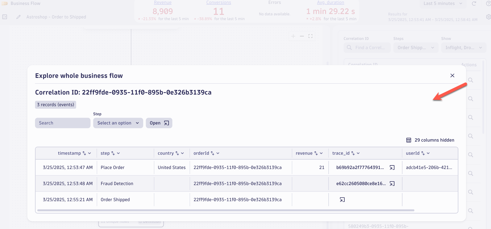

## Data Validation

In this section of the lab we will validate the data for the `Business Flow` for the Astroshop `Order to Shipped` business process. 

### Business Flow App

Business processes are the automation backbone of modern businesses, and they must operate efficiently to meet business goals. Most of those processes can impact customer experience, either positively or negatively. 

Most organizations rely on hundreds, if not thousands, of business processes, from procurement to order fulfillment. These processes depend on your IT systems to achieve their goals efficiently and at scale. The `Business Flow` app makes it easier than ever to monitor complex business processes.

### Reported KPIs

In the `Business Flow App`,  top section we should have data for the following:

* Revenue - Business performance indicator (by default, revenue)
* Conversions - Fulfillment or conversion of unique flows in the business process
* Avg. Duration - Average flow duration (the time from start to end of a business process)

[Reported KPIs Documentation](https://docs.dynatrace.com/docs/shortlink/business-flow-reported-kpis)

### Tree View

The Tree view displays all steps with the corresponding numbers of unique flows at each step. If you have defined business exceptions, the number of exceptions is displayed for each relevant step. We should have data for the following:

* Unique Flows for each Step
* Drops - A drop is an incomplete business process that fails to reach the next step due to an IT error, a business exception, or an above-average delay. It is also referred to as dropped flow
* Inflights - An inflight flow refers to a unique business process flow that is in progress at a given step. It remains inflight unless it exceeds the average delay for that step, at which point it is considered a dropped flow (drop).
* Avg. Duration between each step

[Terminology Documenation](https://docs.dynatrace.com/docs/shortlink/business-flow-reported-kpis#terminology)

### Flow details

 On the side panel, expand the dropdown menu to see a list of completed unique flows that have reached that step. For any of the listed flows, select the magnifying glass icon (under Actions in the rightmost side panel) to explore the end-to-end business flow details.

### Conclusion

We have completed data validation for the Astroshop `Order to Shipped` Business Flow.