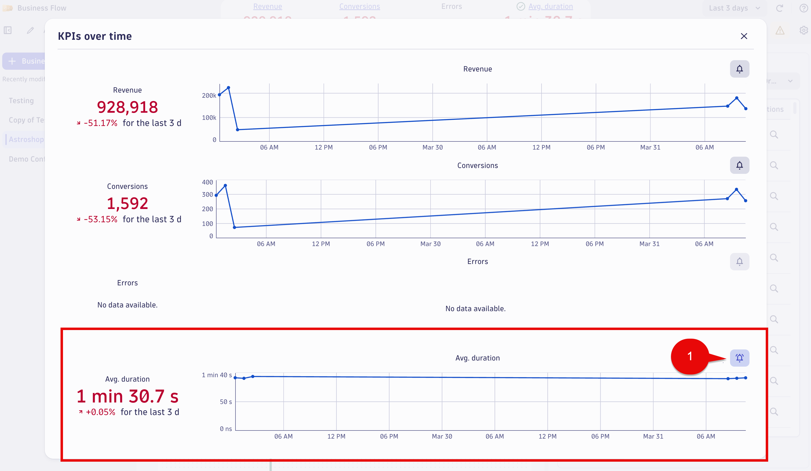
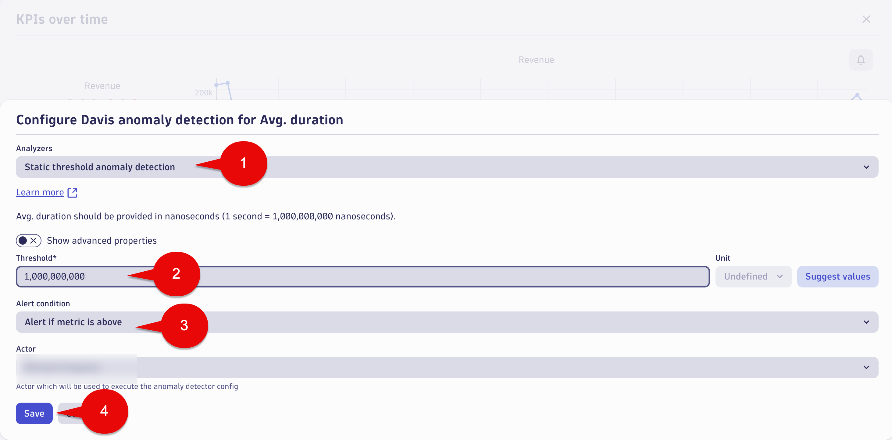

## Business Flow Alerting

The Business Flow app includes Davis Anomaly Detectors for the following: 

* Business KPIs 
* Conversions/Fulfilment
* Errors/Business Exceptions
* Avg duration

Davis Anomaly Detectors are created from Business Flow app which will generate Davis events that will derive in Davis Problems, appearing in the Problems app.

This feature uses a sliding window of 60 minutes, and analyzer is triggered every minute.

In this section of the lab, using the Business Flow app,  we will enable Davis anomaly detection for `Avg. duration` for the Astroshop `Order to Shipped` business process. 

### Business Flow - Astroshop - Order to Shipped - Davis Alert

Using the Business Flow app, Open the `Astroshop - Order to Shipped` Business Flow

At the top of the screen in the KPIs overview,  click the Avg. Duration link.


The `KPIs over time` screen will appear.  

Find the `Avg. duration` section,  bottom of the screen.

In the chart section for the `Avg. duration` click the bell icon next to the chart,  it will be on the right side.



The `Configure Davis anomaly detection for Avg. duration` screen will appear.

In the `Analyzers` section, confirm the setting selected is the following:

```txt
Static threshold is anomaly detection
```

Please use the following value in the `Threshold` field:

```txt
60,000,000,000
```

In the `Alert condition` confirm the setting selected is the following: 

```txt
Alert if metric is above
```

Click the Save button.




### Conclusion

We have completed configuration for the Business Flow Davis Anomaly Detector for  `Avg. duration` greater than 1 second for the `Astroshop - Order to Shipped` Business Flow.  We set this value to low for the lab exercise so a Problem will be generated. The next section will validate the data.  