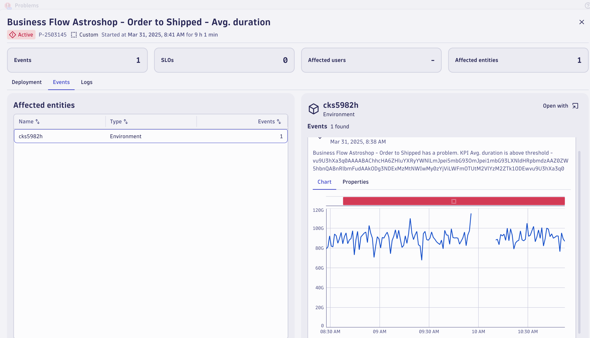

## Data Validation

In this section of the lab we will validate the data Business Flow Davis Anomaly Detector for  `Avg. duration` greater than 1 second for the `Astroshop - Order to Shipped` Business Flow.   

### Problems App

Open the Problems App.

A new problem will be generated called `Business Flow Astroshop - Order to Shipped - Avg. duration`.

This might take 5-10 minutes. We can come back and check after the next lab.

Click the `Business Flow Astroshop - Order to Shipped - Avg. duration` which will open the Problem details screen.

### Conclusion

We have completed data validation for the Business Flow Davis Anomaly Detector for `Avg. duration`.