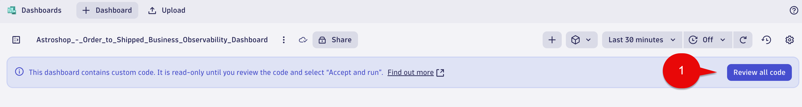
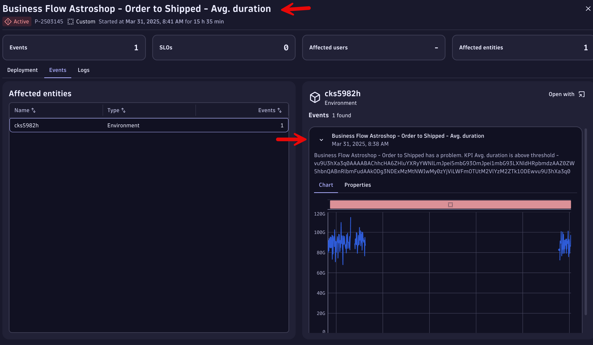
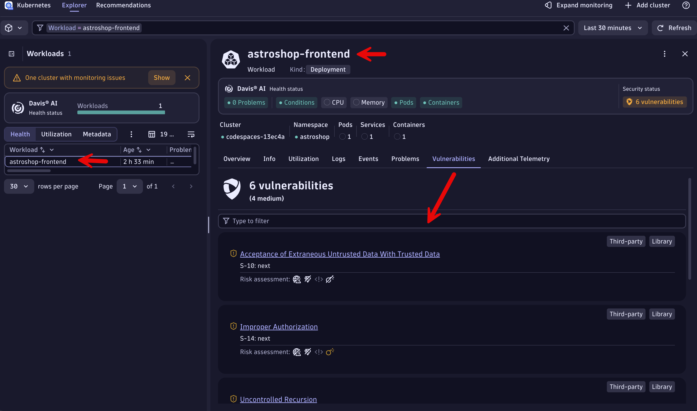

## Business Observability Dashboard

As part of this training we have provided a Business Observability dashboard to upload. 

This dashboard provides a comprehensive, real-time view of your business's key performance indicators (KPIs) and operational health, enabling data-driven decision-making and proactive problem-solving.  

This dashboard encompasses all of the training topics we covered today in a single view.  

The example dashboard is also meant to provide ideas for the Art of the Possible when working with Business Observability uses cases.

### Astroshop - Order to Shipped Business Observability Dashboard - Download

Download the dashboard `Astroshop - Order to Shipped Business Observability Dashboard` using the source file [Astroshop_-_Order_to_Shipped_Business_Observability_Dashboard.json](https://github.com/dynatrace-wwse/enablement-business-observability/blob/main/lab-guide/assets/Astroshop_-_Order_to_Shipped_Business_Observability_Dashboard.json) to your local system.

### Astroshop - Order to Shipped Business Observability Dashboard - Upload

Open the `Dashboards` app.

Select the `Upload` button and pick the Astroshop_-_Order_to_Shipped_Business_Observability_Dashboard.json from your local system.


When the Astroshop_-_Order_to_Shipped_Business_Observability_Dashboard first loads a `Review all code` button appears.  

Select the `Review all code` button.



A `Review Code` box will appear.

Select the checkbox for "Always trust code in this document".

Then select the `Accept and run` button.


When uploaded,  you should see all tiles with data.


### Enable IT ISSUES

Wait,  there is more fun!!

Go to your Astroshop UI browser tab.

In the url address bar, append the following to the end of the url.

```txt
/feature
```
Find the `paymentServiceUnreachable` and select the drop down to on.

Then select the `save` button.


Note: Select this link [Astroshop/OpenTelemetry Demo App Feature Flags](https://opentelemetry.io/docs/demo/feature-flags/) for more details on the Feature Flags.

### IT ISSUES - Place Order Step

Within 10 minutes an IT Issue should be opened in the `Place Order` Step section of the dashboard.  You will need to refresh the dashboard as auto-refresh is turned off.   


Click the `IT` link in the drilldown section under the `Place Order` Step.  This will open the IT Problem that was automatically detected by the Davis AI.


### BUSINESS ISSUES - Place Order Step


Click the `Business` link in the drilldown section under the `Place Order` Step.  This will open the Business Problem that was generated from our previous lab, `Avg. duration` greater than 1 second for the `Astroshop - Order to Shipped` Business Process.



### SECURITY ISSUES - Place Order Step


Click the `Security` link in the drilldown section under the `Place Order` Step.  This will open all open vulnerabilities for the Astroshop-Frontend workload,  which supports `Place Order` Step of the Business Process.



### Conclusion

We have completed the hands on exercises for the training.  We will now move to the Wrap Up section.